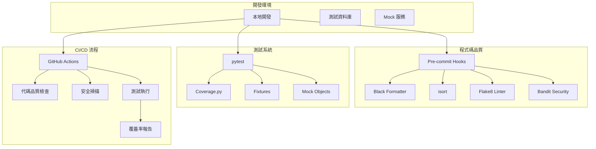

# 🥔 Potato Bot - 開發者文檔

<div align="center">

[](https://github.com/Craig-0219/potato)
[](https://python.org)
[](https://discordpy.readthedocs.io)
[](#測試覆蓋率)
[](https://pre-commit.com/)

**開發環境完整指南**

*包含 CI/CD 流程 • 測試框架 • 程式碼品質工具*

</div>

## 📖 開發者目錄

- [🛠️ 快速開發設置](#️-快速開發設置)
- [🏗️ 開發架構](#️-開發架構)
- [💻 開發流程](#-開發流程)
- [🧪 測試系統](#-測試系統)
- [🔄 CI/CD 流程](#-cicd-流程)
- [📊 程式碼品質](#-程式碼品質)
- [🛡️ 安全開發](#️-安全開發)
- [🐛 除錯指南](#-除錯指南)
- [📚 開發資源](#-開發資源)

## 🛠️ 快速開發設置

### 環境準備

```bash
# 1. 克隆開發分支
git clone -b develop https://github.com/Craig-0219/potato.git
cd potato

# 2. 建立開發虛擬環境
python3.10 -m venv venv
source venv/bin/activate  # Linux/macOS
# 或 Windows: venv\Scripts\activate

# 3. 安裝完整開發依賴
pip install -r requirements.txt
pip install -r requirements-dev.txt  # 開發工具

# 4. 設置開發工具
pre-commit install
black --check bot/ shared/
isort --check-only bot/ shared/
```

### 開發環境配置

```bash
# 複製開發配置範例
cp .env.example .env.dev

# 開發環境專用配置
cat >> .env.dev << EOF
# 開發環境設定
NODE_ENV=development
ENVIRONMENT=development
DEBUG=true
LOG_LEVEL=DEBUG

# 開發資料庫 (建議使用 SQLite 快速開發)
DATABASE_URL=sqlite:///dev_potato.db

# 測試機器人 Token (使用測試伺服器)
DISCORD_TOKEN=your_development_bot_token
DISCORD_GUILD_ID=your_test_server_id

# 開發功能開關
SYNC_COMMANDS=true
TESTING=false
DEBUG_VERBOSE=true

# 快速開發設定
AI_RATE_LIMIT_USER=1000
AI_DAILY_FREE_QUOTA=1000
TICKET_MAX_PER_USER=10
EOF
```

### IDE 設置

#### VSCode 推薦設置

```json
// .vscode/settings.json
{
  "python.defaultInterpreter": "./venv/bin/python",
  "python.linting.enabled": true,
  "python.linting.flake8Enabled": true,
  "python.formatting.provider": "black",
  "python.sortImports.args": ["--profile", "black"],
  "editor.formatOnSave": true,
  "editor.codeActionsOnSave": {
    "source.organizeImports": true
  },
  "python.testing.pytestEnabled": true,
  "python.testing.pytestArgs": ["tests/"],
  "files.exclude": {
    "**/__pycache__": true,
    "**/.pytest_cache": true,
    "**/.coverage": true,
    "**/htmlcov": true
  }
}
```

#### PyCharm 設置

- 設定 Python 解譯器為 `./venv/bin/python`
- 啟用 Black 格式化工具
- 配置 pytest 為預設測試運行器
- 啟用代碼檢查工具 (Flake8, Bandit)

## 🏗️ 開發架構

### 專案結構

```
potato/
├── bot/                    # 機器人核心程式碼
│   ├── __init__.py
│   ├── main.py            # 主要啟動檔案
│   ├── core/              # 核心系統
│   │   ├── bot.py         # Discord Bot 核心
│   │   ├── database.py    # 資料庫連線管理
│   │   └── config.py      # 配置管理
│   ├── cogs/              # 功能模組 (Discord Cogs)
│   │   ├── ticket.py      # 票券系統
│   │   ├── voting.py      # 投票系統
│   │   ├── ai_chat.py     # AI 聊天
│   │   └── economy.py     # 經濟系統
│   ├── services/          # 業務邏輯服務
│   │   ├── ticket_service.py
│   │   ├── ai_service.py
│   │   └── economy_service.py
│   └── utils/             # 工具模組
│       ├── validators.py
│       ├── formatters.py
│       └── exceptions.py
├── shared/                # 共用程式碼
│   ├── config.py         # 全局配置
│   ├── database/         # 資料庫模型和遷移
│   │   ├── models.py     # SQLAlchemy 模型
│   │   └── migrations/   # 資料庫遷移檔案
│   └── utils/            # 共用工具
├── src/                  # Web API 和前端
│   ├── api/              # FastAPI 後端
│   └── web-ui/           # Next.js 前端
├── tests/                # 測試檔案
│   ├── unit/             # 單元測試
│   ├── integration/      # 整合測試
│   ├── e2e/              # 端到端測試
│   └── fixtures/         # 測試資料
├── docs/                 # 專案文檔
├── .github/              # GitHub Actions 工作流程
│   ├── workflows/
│   └── scripts/
└── scripts/              # 開發和部署腳本
    ├── dev_setup.py
    ├── test_runner.py
    └── deploy.py
```

### 技術架構圖



## 💻 開發流程

### Git 工作流程

```bash
# 1. 從 develop 分支建立功能分支
git checkout develop
git pull origin develop
git checkout -b feature/ticket-system-enhancement

# 2. 進行開發
# 編寫程式碼...
# 撰寫測試...
# 運行測試...

# 3. 提交變更 (會自動觸發 pre-commit hooks)
git add .
git commit -m "feat(ticket): add auto-assignment feature

- Implement automatic ticket assignment based on staff availability
- Add configuration options for assignment rules
- Include unit tests for assignment logic

Closes #123"

# 4. 推送並建立 Pull Request
git push origin feature/ticket-system-enhancement
gh pr create --title "feat(ticket): add auto-assignment feature" --body "詳細說明..."
```

### 提交訊息規範

遵循 [Conventional Commits](https://www.conventionalcommits.org/) 規範：

```
<type>(<scope>): <subject>

[optional body]

[optional footer]
```

**類型 (type):**
- `feat`: 新功能
- `fix`: 錯誤修復
- `docs`: 文檔更新
- `style`: 代碼格式調整
- `refactor`: 重構
- `test`: 測試相關
- `chore`: 建置或輔助工具變動

**範圍 (scope):**
- `ticket`: 票券系統
- `vote`: 投票系統
- `ai`: AI 功能
- `economy`: 經濟系統
- `core`: 核心功能
- `api`: API 相關
- `ui`: 使用者介面

### 開發最佳實踐

#### 1. 測試驅動開發 (TDD)

```python
# 1. 先寫測試 (Red)
def test_ticket_auto_assignment():
    """測試票券自動分配功能"""
    # Given
    staff_members = create_mock_staff()
    ticket = create_mock_ticket()
    
    # When
    assigned_staff = assign_ticket_automatically(ticket, staff_members)
    
    # Then
    assert assigned_staff is not None
    assert assigned_staff.is_available is True

# 2. 實現最小功能 (Green)
def assign_ticket_automatically(ticket, staff_members):
    """自動分配票券給可用的客服人員"""
    available_staff = [s for s in staff_members if s.is_available]
    if available_staff:
        return available_staff[0]  # 簡單實現
    return None

# 3. 重構改進 (Refactor)
def assign_ticket_automatically(ticket, staff_members):
    """智能分配票券給最適合的客服人員"""
    available_staff = [s for s in staff_members if s.is_available]
    if not available_staff:
        return None
    
    # 根據工作量和專業領域智能分配
    return min(available_staff, key=lambda s: s.current_workload)
```

#### 2. 程式碼組織原則

```python
# 良好的程式碼組織範例
class TicketService:
    """票券服務類別 - 單一職責原則"""
    
    def __init__(self, database: Database, notifier: NotificationService):
        self.database = database
        self.notifier = notifier
    
    async def create_ticket(self, user_id: int, content: str) -> Ticket:
        """創建新票券"""
        # 輸入驗證
        if not content.strip():
            raise ValueError("票券內容不能為空")
        
        # 業務邏輯
        ticket = Ticket(
            user_id=user_id,
            content=content,
            status=TicketStatus.OPEN,
            created_at=datetime.utcnow()
        )
        
        # 持久化
        await self.database.save(ticket)
        
        # 通知相關人員
        await self.notifier.notify_new_ticket(ticket)
        
        return ticket
```

#### 3. 錯誤處理

```python
# 統一錯誤處理模式
class TicketError(Exception):
    """票券系統基礎異常"""
    pass

class TicketNotFoundError(TicketError):
    """票券不存在異常"""
    pass

class TicketPermissionError(TicketError):
    """票券權限異常"""
    pass

# 在服務層進行錯誤處理
async def close_ticket(self, ticket_id: int, user_id: int) -> None:
    try:
        ticket = await self.database.get_ticket(ticket_id)
        if not ticket:
            raise TicketNotFoundError(f"票券 {ticket_id} 不存在")
        
        if not self.can_close_ticket(ticket, user_id):
            raise TicketPermissionError("沒有權限關閉此票券")
        
        ticket.status = TicketStatus.CLOSED
        ticket.closed_at = datetime.utcnow()
        await self.database.save(ticket)
        
    except TicketError:
        # 重新拋出業務異常
        raise
    except Exception as e:
        # 記錄未預期的錯誤
        logger.error(f"關閉票券時發生未預期錯誤: {e}", exc_info=True)
        raise TicketError("系統錯誤，請稍後再試")
```

## 🧪 測試系統

### 測試架構

```python
# tests/conftest.py - 測試配置和共用 fixtures
import pytest
import asyncio
from unittest.mock import AsyncMock, MagicMock
from bot.core.database import Database
from bot.services.ticket_service import TicketService

@pytest.fixture
async def database():
    """測試資料庫 fixture"""
    db = Database(":memory:")  # 使用記憶體 SQLite
    await db.create_tables()
    yield db
    await db.close()

@pytest.fixture
def mock_discord_user():
    """模擬 Discord 用戶"""
    user = MagicMock()
    user.id = 123456789
    user.name = "TestUser"
    user.display_name = "測試用戶"
    return user

@pytest.fixture
async def ticket_service(database):
    """票券服務 fixture"""
    notifier = AsyncMock()
    return TicketService(database, notifier)
```

### 單元測試範例

```python
# tests/unit/services/test_ticket_service.py
import pytest
from bot.services.ticket_service import TicketService
from bot.models.ticket import TicketStatus

class TestTicketService:
    """票券服務單元測試"""
    
    @pytest.mark.asyncio
    async def test_create_ticket_success(self, ticket_service, mock_discord_user):
        """測試成功創建票券"""
        # Given
        content = "我需要幫助設置機器人"
        
        # When
        ticket = await ticket_service.create_ticket(
            user_id=mock_discord_user.id,
            content=content
        )
        
        # Then
        assert ticket is not None
        assert ticket.user_id == mock_discord_user.id
        assert ticket.content == content
        assert ticket.status == TicketStatus.OPEN
    
    @pytest.mark.asyncio
    async def test_create_ticket_empty_content(self, ticket_service, mock_discord_user):
        """測試空內容創建票券失敗"""
        # Given
        content = ""
        
        # When & Then
        with pytest.raises(ValueError, match="票券內容不能為空"):
            await ticket_service.create_ticket(
                user_id=mock_discord_user.id,
                content=content
            )
    
    @pytest.mark.asyncio
    async def test_ticket_assignment(self, ticket_service, mock_discord_user):
        """測試票券自動分配"""
        # Given
        ticket = await ticket_service.create_ticket(
            user_id=mock_discord_user.id,
            content="需要技術支援"
        )
        staff_list = [
            MagicMock(id=1, is_available=True, workload=2),
            MagicMock(id=2, is_available=True, workload=1),
            MagicMock(id=3, is_available=False, workload=0),
        ]
        
        # When
        assigned_staff = await ticket_service.auto_assign_ticket(ticket, staff_list)
        
        # Then
        assert assigned_staff is not None
        assert assigned_staff.id == 2  # 選擇工作量最少的可用人員
```

### 整合測試範例

```python
# tests/integration/test_ticket_flow.py
import pytest
from bot.core.bot import PotatomBot
from bot.cogs.ticket import TicketCog

class TestTicketIntegration:
    """票券系統整合測試"""
    
    @pytest.mark.asyncio
    async def test_full_ticket_lifecycle(self, bot_instance, test_guild, test_user):
        """測試完整的票券生命週期"""
        # Given
        ticket_cog = TicketCog(bot_instance)
        
        # When - 用戶創建票券
        ctx = create_mock_context(test_guild, test_user, "!ticket 我需要幫助")
        await ticket_cog.create_ticket(ctx, content="我需要幫助")
        
        # Then - 檢查票券是否成功創建
        tickets = await ticket_cog.service.get_user_tickets(test_user.id)
        assert len(tickets) == 1
        assert tickets[0].status == TicketStatus.OPEN
        
        # When - 客服回覆票券
        staff_ctx = create_mock_context(test_guild, test_staff, "!reply 1 這裡是回覆")
        await ticket_cog.reply_ticket(staff_ctx, ticket_id=1, content="這裡是回覆")
        
        # Then - 檢查回覆是否記錄
        replies = await ticket_cog.service.get_ticket_replies(1)
        assert len(replies) == 1
        assert replies[0].content == "這裡是回覆"
        
        # When - 關閉票券
        close_ctx = create_mock_context(test_guild, test_staff, "!close 1")
        await ticket_cog.close_ticket(close_ctx, ticket_id=1)
        
        # Then - 檢查票券是否關閉
        ticket = await ticket_cog.service.get_ticket(1)
        assert ticket.status == TicketStatus.CLOSED
        assert ticket.closed_at is not None
```

### 測試覆蓋率

```bash
# 運行測試並生成覆蓋率報告
pytest --cov=bot --cov=shared --cov-report=html --cov-report=term

# 檢視覆蓋率報告
# HTML 報告：htmlcov/index.html
# 終端報告會直接顯示
```

目標覆蓋率標準：
- **整體覆蓋率**: >= 85%
- **核心功能**: >= 90%
- **服務層**: >= 95%
- **工具模組**: >= 80%

## 🔄 CI/CD 流程

### GitHub Actions 工作流程

#### 1. 程式碼品質檢查

```yaml
# .github/workflows/code-quality.yml
name: 程式碼品質檢查

on:
  pull_request:
    branches: [develop, main]
  push:
    branches: [develop]

jobs:
  code-quality:
    runs-on: ubuntu-latest
    steps:
      - uses: actions/checkout@v4
      
      - name: 設置 Python
        uses: actions/setup-python@v4
        with:
          python-version: '3.10'
          
      - name: 安裝依賴
        run: |
          pip install -r requirements.txt
          pip install -r requirements-dev.txt
          
      - name: Black 格式檢查
        run: black --check bot/ shared/
        
      - name: isort 導入排序檢查
        run: isort --check-only bot/ shared/
        
      - name: Flake8 代碼風格檢查
        run: flake8 bot/ shared/
        
      - name: Bandit 安全掃描
        run: bandit -r bot/ shared/ -f json -o bandit-report.json
        
      - name: 上傳安全報告
        uses: actions/upload-artifact@v4
        with:
          name: security-report
          path: bandit-report.json
```

#### 2. 測試執行

```yaml
# .github/workflows/tests.yml
name: 測試執行

on:
  pull_request:
    branches: [develop, main]
  push:
    branches: [develop]

jobs:
  test:
    runs-on: ubuntu-latest
    strategy:
      matrix:
        python-version: [3.10, 3.11, 3.12]
        
    steps:
      - uses: actions/checkout@v4
      
      - name: 設置 Python ${{ matrix.python-version }}
        uses: actions/setup-python@v4
        with:
          python-version: ${{ matrix.python-version }}
          
      - name: 安裝依賴
        run: |
          pip install -r requirements.txt
          pip install pytest pytest-cov pytest-asyncio
          
      - name: 運行單元測試
        run: pytest tests/unit/ -v
        
      - name: 運行整合測試
        run: pytest tests/integration/ -v
        
      - name: 運行覆蓋率測試
        run: pytest --cov=bot --cov=shared --cov-report=xml
        
      - name: 上傳覆蓋率報告到 Codecov
        uses: codecov/codecov-action@v3
        with:
          file: ./coverage.xml
```

#### 3. 自動部署

```yaml
# .github/workflows/deploy.yml
name: 自動部署

on:
  push:
    branches: [main]
  workflow_dispatch:

jobs:
  deploy:
    runs-on: ubuntu-latest
    if: github.ref == 'refs/heads/main'
    
    steps:
      - uses: actions/checkout@v4
      
      - name: 部署到生產環境
        run: |
          # 執行部署腳本
          ./scripts/deploy.sh
        env:
          DEPLOY_KEY: ${{ secrets.DEPLOY_KEY }}
```

### 分支保護規則

```yaml
# 在 GitHub 設定中配置
branches:
  develop:
    protection:
      required_status_checks:
        - "程式碼品質檢查"
        - "測試執行"
      enforce_admins: false
      required_pull_request_reviews:
        required_approving_review_count: 1
        dismiss_stale_reviews: true
      restrictions: null
      
  main:
    protection:
      required_status_checks:
        - "程式碼品質檢查"
        - "測試執行"
      enforce_admins: true
      required_pull_request_reviews:
        required_approving_review_count: 2
        dismiss_stale_reviews: true
      restrictions:
        users: ["maintainer1", "maintainer2"]
```

## 📊 程式碼品質

### Pre-commit Hooks 配置

```yaml
# .pre-commit-config.yaml
repos:
  - repo: https://github.com/psf/black
    rev: 23.12.1
    hooks:
      - id: black
        language_version: python3.10
        
  - repo: https://github.com/pycqa/isort
    rev: 5.13.2
    hooks:
      - id: isort
        args: ["--profile", "black"]
        
  - repo: https://github.com/pycqa/flake8
    rev: 6.1.0
    hooks:
      - id: flake8
        additional_dependencies: [flake8-docstrings]
        
  - repo: https://github.com/PyCQA/bandit
    rev: 1.7.5
    hooks:
      - id: bandit
        args: ["-r", "bot/", "shared/"]
        
  - repo: https://github.com/pre-commit/mirrors-mypy
    rev: v1.8.0
    hooks:
      - id: mypy
        additional_dependencies: [types-requests]
```

### 程式碼品質工具配置

```ini
# pyproject.toml
[tool.black]
line-length = 88
target-version = ['py310']
include = '\.pyi?$'
extend-exclude = '''
/(
  # 排除的目錄
  migrations
  | venv
  | \.git
)/
'''

[tool.isort]
profile = "black"
multi_line_output = 3
line_length = 88
known_first_party = ["bot", "shared"]

[tool.flake8]
max-line-length = 88
extend-ignore = ["E203", "W503"]
exclude = [
    ".git",
    "__pycache__",
    "venv",
    "migrations",
]

[tool.pytest.ini_options]
testpaths = ["tests"]
python_files = ["test_*.py", "*_test.py"]
python_classes = ["Test*"]
python_functions = ["test_*"]
addopts = "-v --strict-markers --disable-warnings"
markers = [
    "slow: marks tests as slow (deselect with '-m \"not slow\"')",
    "integration: marks tests as integration tests",
    "e2e: marks tests as end-to-end tests",
]
```

### 程式碼審查清單

#### 功能性檢查
- [ ] 功能是否按預期工作？
- [ ] 邊界條件是否處理正確？
- [ ] 錯誤情況是否妥善處理？
- [ ] 是否有適當的測試覆蓋？

#### 程式碼品質檢查
- [ ] 程式碼是否遵循 PEP 8 風格指南？
- [ ] 函數和類別是否有適當的文檔字符串？
- [ ] 變數和函數命名是否清晰？
- [ ] 是否有重複的程式碼需要重構？

#### 安全性檢查
- [ ] 是否有 SQL 注入風險？
- [ ] 使用者輸入是否經過驗證？
- [ ] 敏感資訊是否暴露在日誌中？
- [ ] 是否使用了安全的加密方法？

#### 效能檢查
- [ ] 是否有效率問題？
- [ ] 資料庫查詢是否最佳化？
- [ ] 是否有記憶體洩漏？
- [ ] 異步操作是否正確使用？

## 🛡️ 安全開發

### 安全程式設計原則

#### 1. 輸入驗證

```python
from pydantic import BaseModel, validator, Field
from typing import Optional

class TicketCreateRequest(BaseModel):
    """票券創建請求模型"""
    
    content: str = Field(..., min_length=1, max_length=2000)
    category: Optional[str] = Field(None, max_length=50)
    priority: Optional[int] = Field(1, ge=1, le=5)
    
    @validator('content')
    def validate_content(cls, v):
        """驗證內容安全性"""
        if not v.strip():
            raise ValueError('內容不能為空')
        
        # 檢查惡意內容
        dangerous_patterns = ['<script', 'javascript:', 'data:']
        content_lower = v.lower()
        for pattern in dangerous_patterns:
            if pattern in content_lower:
                raise ValueError('內容包含不安全的元素')
        
        return v.strip()
    
    @validator('category')
    def validate_category(cls, v):
        """驗證類別有效性"""
        if v is None:
            return v
        
        allowed_categories = ['general', 'technical', 'billing', 'feedback']
        if v not in allowed_categories:
            raise ValueError(f'無效的類別: {v}')
        
        return v
```

#### 2. SQL 注入防護

```python
from sqlalchemy import select, update
from sqlalchemy.ext.asyncio import AsyncSession

class TicketRepository:
    """票券資料庫存取層"""
    
    def __init__(self, session: AsyncSession):
        self.session = session
    
    async def get_tickets_by_user(self, user_id: int, status: Optional[str] = None):
        """安全的查詢用戶票券"""
        # 使用參數化查詢防止 SQL 注入
        query = select(Ticket).where(Ticket.user_id == user_id)
        
        if status:
            # 驗證狀態值
            valid_statuses = ['open', 'in_progress', 'closed']
            if status not in valid_statuses:
                raise ValueError(f"無效的狀態: {status}")
            query = query.where(Ticket.status == status)
        
        result = await self.session.execute(query)
        return result.scalars().all()
    
    async def update_ticket_status(self, ticket_id: int, status: str, user_id: int):
        """安全的更新票券狀態"""
        # 參數驗證
        if not isinstance(ticket_id, int) or ticket_id <= 0:
            raise ValueError("無效的票券 ID")
        
        valid_statuses = ['open', 'in_progress', 'closed']
        if status not in valid_statuses:
            raise ValueError(f"無效的狀態: {status}")
        
        # 使用參數化查詢
        query = (
            update(Ticket)
            .where(Ticket.id == ticket_id)
            .where(Ticket.user_id == user_id)  # 確保用戶只能修改自己的票券
            .values(status=status, updated_at=func.now())
        )
        
        await self.session.execute(query)
        await self.session.commit()
```

#### 3. 機敏資料保護

```python
import hashlib
import secrets
from cryptography.fernet import Fernet
from typing import Optional

class SecurityUtils:
    """安全工具類"""
    
    def __init__(self, encryption_key: bytes):
        self.cipher = Fernet(encryption_key)
    
    @staticmethod
    def generate_api_key() -> str:
        """生成安全的 API 金鑰"""
        return secrets.token_urlsafe(32)
    
    @staticmethod
    def hash_password(password: str, salt: Optional[str] = None) -> tuple[str, str]:
        """安全的密碼雜湊"""
        if salt is None:
            salt = secrets.token_hex(32)
        
        # 使用 PBKDF2 進行雜湊
        hashed = hashlib.pbkdf2_hmac('sha256', password.encode(), salt.encode(), 100000)
        return hashed.hex(), salt
    
    def encrypt_sensitive_data(self, data: str) -> str:
        """加密敏感資料"""
        return self.cipher.encrypt(data.encode()).decode()
    
    def decrypt_sensitive_data(self, encrypted_data: str) -> str:
        """解密敏感資料"""
        return self.cipher.decrypt(encrypted_data.encode()).decode()
    
    @staticmethod
    def sanitize_log_data(data: dict) -> dict:
        """清理日誌資料，移除敏感資訊"""
        sensitive_keys = ['password', 'token', 'api_key', 'secret']
        sanitized = {}
        
        for key, value in data.items():
            if any(sensitive in key.lower() for sensitive in sensitive_keys):
                sanitized[key] = "[REDACTED]"
            elif isinstance(value, dict):
                sanitized[key] = SecurityUtils.sanitize_log_data(value)
            else:
                sanitized[key] = value
        
        return sanitized
```

### 安全檢查自動化

```python
# scripts/security_scan.py
#!/usr/bin/env python3
"""自動化安全掃描腳本"""

import subprocess
import json
import sys
from pathlib import Path

def run_bandit_scan():
    """執行 Bandit 安全掃描"""
    print("🔍 執行 Bandit 安全掃描...")
    
    cmd = [
        "bandit",
        "-r", "bot/", "shared/",
        "-f", "json",
        "-o", "bandit-report.json"
    ]
    
    result = subprocess.run(cmd, capture_output=True, text=True)
    
    if result.returncode != 0:
        print(f"❌ Bandit 掃描發現安全問題")
        
        # 解析報告
        if Path("bandit-report.json").exists():
            with open("bandit-report.json", "r") as f:
                report = json.load(f)
            
            print(f"發現 {len(report.get('results', []))} 個安全問題:")
            for issue in report.get('results', []):
                print(f"  - {issue['test_name']}: {issue['issue_text']}")
                print(f"    檔案: {issue['filename']}:{issue['line_number']}")
        
        return False
    
    print("✅ Bandit 掃描通過")
    return True

def run_safety_check():
    """檢查依賴套件漏洞"""
    print("🔍 檢查依賴套件安全漏洞...")
    
    result = subprocess.run(["safety", "check", "--json"], capture_output=True, text=True)
    
    if result.returncode != 0:
        print("❌ 發現套件安全漏洞")
        try:
            vulnerabilities = json.loads(result.stdout)
            for vuln in vulnerabilities:
                print(f"  - {vuln['package']}: {vuln['vulnerability']}")
        except json.JSONDecodeError:
            print(result.stdout)
        return False
    
    print("✅ 依賴套件安全檢查通過")
    return True

def main():
    """主函數"""
    print("🛡️ 開始安全掃描...")
    
    all_passed = True
    
    # 執行各項安全檢查
    all_passed &= run_bandit_scan()
    all_passed &= run_safety_check()
    
    if all_passed:
        print("🎉 所有安全檢查通過！")
        sys.exit(0)
    else:
        print("💥 安全檢查失敗，請修復問題後重新執行")
        sys.exit(1)

if __name__ == "__main__":
    main()
```

## 🐛 除錯指南

### 日誌系統設置

```python
# bot/utils/logging.py
import logging
import sys
from pathlib import Path
from datetime import datetime

def setup_logging(log_level: str = "INFO", log_file: str = None):
    """設置應用程式日誌系統"""
    
    # 創建 logs 目錄
    log_dir = Path("logs")
    log_dir.mkdir(exist_ok=True)
    
    # 設置日誌格式
    formatter = logging.Formatter(
        fmt="%(asctime)s - %(name)s - %(levelname)s - %(message)s",
        datefmt="%Y-%m-%d %H:%M:%S"
    )
    
    # 設置根日誌器
    root_logger = logging.getLogger()
    root_logger.setLevel(getattr(logging, log_level.upper()))
    
    # 控制台處理器
    console_handler = logging.StreamHandler(sys.stdout)
    console_handler.setLevel(logging.INFO)
    console_handler.setFormatter(formatter)
    root_logger.addHandler(console_handler)
    
    # 檔案處理器
    if log_file is None:
        log_file = f"logs/bot_{datetime.now().strftime('%Y%m%d')}.log"
    
    file_handler = logging.FileHandler(log_file, encoding='utf-8')
    file_handler.setLevel(logging.DEBUG)
    file_handler.setFormatter(formatter)
    root_logger.addHandler(file_handler)
    
    # Discord.py 日誌設置
    discord_logger = logging.getLogger('discord')
    discord_logger.setLevel(logging.INFO)
    
    return root_logger

# 使用範例
logger = setup_logging()

class TicketService:
    def __init__(self):
        self.logger = logging.getLogger(__name__)
    
    async def create_ticket(self, user_id: int, content: str):
        self.logger.info(f"用戶 {user_id} 創建票券")
        
        try:
            # 業務邏輯...
            ticket = await self._create_ticket_internal(user_id, content)
            self.logger.info(f"票券創建成功: {ticket.id}")
            return ticket
            
        except Exception as e:
            self.logger.error(f"創建票券失敗: {e}", exc_info=True)
            raise
```

### 除錯工具

```python
# bot/utils/debugging.py
import functools
import time
import asyncio
from typing import Callable, Any

def debug_async_func(func: Callable) -> Callable:
    """異步函數除錯裝飾器"""
    @functools.wraps(func)
    async def wrapper(*args, **kwargs):
        func_name = f"{func.__module__}.{func.__qualname__}"
        print(f"🐛 [DEBUG] 開始執行: {func_name}")
        print(f"📥 [DEBUG] 參數: args={args}, kwargs={kwargs}")
        
        start_time = time.time()
        try:
            result = await func(*args, **kwargs)
            execution_time = time.time() - start_time
            print(f"✅ [DEBUG] 執行完成: {func_name} ({execution_time:.3f}s)")
            print(f"📤 [DEBUG] 返回值: {result}")
            return result
            
        except Exception as e:
            execution_time = time.time() - start_time
            print(f"❌ [DEBUG] 執行失敗: {func_name} ({execution_time:.3f}s)")
            print(f"💥 [DEBUG] 異常: {type(e).__name__}: {e}")
            raise
            
    return wrapper

def performance_monitor(threshold: float = 1.0):
    """效能監控裝飾器"""
    def decorator(func: Callable) -> Callable:
        @functools.wraps(func)
        async def wrapper(*args, **kwargs):
            start_time = time.time()
            
            result = await func(*args, **kwargs)
            
            execution_time = time.time() - start_time
            if execution_time > threshold:
                print(f"⚠️ [PERF] 慢查詢警告: {func.__name__} 執行時間 {execution_time:.3f}s")
            
            return result
        return wrapper
    return decorator

# 使用範例
class TicketService:
    @debug_async_func
    @performance_monitor(threshold=0.5)
    async def get_user_tickets(self, user_id: int):
        """獲取用戶票券（帶除錯和效能監控）"""
        # 業務邏輯...
        pass
```

### 常見問題排查

#### 1. Discord 連線問題

```python
# 診斷 Discord 連線
async def diagnose_discord_connection(bot):
    """診斷 Discord 連線狀態"""
    print("🔍 診斷 Discord 連線...")
    
    # 檢查 Token
    if not bot.http.token:
        print("❌ Discord Token 未設定")
        return False
    
    # 檢查連線狀態
    if bot.is_closed():
        print("❌ Bot 連線已關閉")
        return False
    
    # 檢查網路連線
    try:
        latency = bot.latency
        print(f"📡 網路延遲: {latency * 1000:.2f}ms")
        
        if latency > 0.5:
            print("⚠️ 網路延遲過高")
        
    except Exception as e:
        print(f"❌ 網路檢查失敗: {e}")
        return False
    
    # 檢查公會連線
    guild_count = len(bot.guilds)
    print(f"🏠 已連線公會數: {guild_count}")
    
    if guild_count == 0:
        print("⚠️ 未連線到任何公會")
    
    print("✅ Discord 連線診斷完成")
    return True
```

#### 2. 資料庫問題診斷

```python
# 診斷資料庫連線
async def diagnose_database_connection(database):
    """診斷資料庫連線狀態"""
    print("🔍 診斷資料庫連線...")
    
    try:
        # 測試連線
        await database.execute("SELECT 1")
        print("✅ 資料庫連線正常")
        
        # 檢查表格
        tables = await database.get_table_names()
        print(f"📊 資料表數量: {len(tables)}")
        
        for table in tables:
            count = await database.execute(f"SELECT COUNT(*) FROM {table}")
            print(f"  - {table}: {count} 筆記錄")
        
        return True
        
    except Exception as e:
        print(f"❌ 資料庫連線失敗: {e}")
        return False
```

### 開發除錯技巧

1. **使用 Python 除錯器**
   ```python
   import pdb; pdb.set_trace()  # 設置中斷點
   ```

2. **異步除錯**
   ```python
   import asyncio
   
   # 在異步函數中使用
   await asyncio.sleep(0)  # 讓出控制權
   print("除錯訊息")
   ```

3. **條件中斷點**
   ```python
   if user_id == 123456789:
       import pdb; pdb.set_trace()
   ```

## 📚 開發資源

### 必讀文檔
- [Discord.py 官方文檔](https://discordpy.readthedocs.io/)
- [FastAPI 官方文檔](https://fastapi.tiangolo.com/)
- [pytest 測試框架](https://docs.pytest.org/)
- [SQLAlchemy ORM](https://docs.sqlalchemy.org/)

### 開發工具推薦
- **IDE**: VSCode, PyCharm
- **版本控制**: Git, GitHub Desktop
- **API 測試**: Postman, Insomnia
- **資料庫管理**: DBeaver, phpMyAdmin
- **監控工具**: htop, Grafana

### 學習資源
- [Python 非同步程式設計](https://docs.python.org/3/library/asyncio.html)
- [Discord Bot 開發指南](https://realpython.com/how-to-make-a-discord-bot-python/)
- [測試驅動開發 (TDD)](https://testdriven.io/)
- [程式碼審查最佳實踐](https://google.github.io/eng-practices/review/)

---

<div align="center">

**開發愉快！** 🚀

[返回主文檔](README.md) • [部署指南](README.prod.md) • [問題回報](https://github.com/Craig-0219/potato/issues)

*本文檔會隨著專案發展持續更新*

</div>