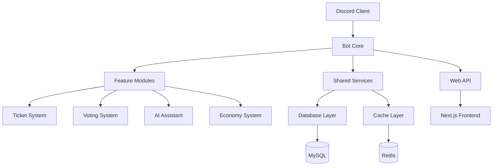

# 🥔 Potato Discord Bot

[](VERSION)
[](https://discord.com)
[](LICENSE)
[](docs/index.md)

> **企業級 Discord 社群管理機器人** - 現代化架構 • AI 整合 • 生產部署

## 🚀 快速部署

```bash
# 1. Install dependencies (using modern package management)
pip install -e .

# 2. Configure environment
cp .env.example .env
nano .env  # Edit with your settings

# 3. Start bot
python start.py
```

## 🏗️ Project Architecture

This project follows a **Domain-Driven Design (DDD)** architecture with modern Python practices:

```
src/
├── potato_bot/           # Main bot application
│   ├── features/        # Feature-based modules
│   │   ├── tickets/     # Ticket system domain
│   │   ├── economy/     # Economy system domain
│   │   ├── security/    # Security & moderation
│   │   ├── ai/          # AI integration
│   │   └── ...         # Other domains
│   ├── core/           # Core infrastructure
│   └── main.py         # Application entry point
├── potato_shared/      # Shared utilities & config
└── tests/             # Comprehensive test suite
```

## 📦 Core Features

### 🎫 **Ticket System**
- Multi-category support with SLA monitoring
- Auto-assignment and smart routing  
- Rating system and advanced analytics
- Customizable workflows and templates

### 🤖 **AI Integration** 
- OpenAI, Anthropic, Gemini API support
- Content analysis and sentiment detection
- Smart conversation management
- Daily usage quotas and rate limiting

### 💰 **Economy System**
- Virtual currency with daily bonuses
- Service costs integration
- User balance tracking

### 🎵 **Music & Entertainment**
- YouTube integration with playlist support
- Gaming features and mini-games
- Content moderation tools

### ⚙️ **Management & Automation**
- Guild management workflows
- Auto-moderation and filtering
- Dashboard with real-time monitoring
- Comprehensive logging system

## 🔧 Configuration

Essential environment variables in `.env`:

```env
# Discord Bot
DISCORD_TOKEN=your_bot_token_here
DISCORD_CLIENT_ID=your_client_id

# Database  
DB_HOST=localhost
DB_USER=your_db_user  
DB_PASSWORD=your_db_password
DB_NAME=potato_bot

# AI Services (Optional)
OPENAI_API_KEY=your_openai_key
ANTHROPIC_API_KEY=your_anthropic_key
GEMINI_API_KEY=your_gemini_key

# Features
TICKET_AUTO_ASSIGNMENT=true
ECONOMY_ENABLED=true
CONTENT_ANALYSIS_ENABLED=true
```

See `.env.example` for complete configuration options.

## 🚀 Deployment Options

### 🦕 Pterodactyl Panel
```bash
# Startup Command
python start.py

# Environment Variables  
# Configure in Pterodactyl environment tab
DISCORD_TOKEN=your_token_here
DB_HOST=database_host
```

### 🐳 Docker
```dockerfile
FROM python:3.11-slim
WORKDIR /app
COPY . .
RUN pip install -e .
EXPOSE 8000
CMD ["python", "start.py"]
```

### 🖥️ VPS/Cloud
```bash
git clone -b ptero https://github.com/Craig-0219/potato.git
cd potato
pip install -e .
cp .env.example .env
python start.py
```

## 🔧 Development Setup

<<<<<<< HEAD
For contributors and developers:

=======
=== "🎫 **智能客服系統**"
    - 自動票券管理、SLA 監控
    - 智能分類、自動路由
    - 評分系統、工作流自動化

=== "🤖 **AI 整合平台**"
    - 多平台支援 (OpenAI、Anthropic、Gemini)
    - 智能對話、內容審核
    - 用量管理、成本控制

=== "🗳️ **實時投票系統**"
    - 動態結果更新、多種模式
    - 權限控制、匿名投票
    - 詳細統計報告

=== "💰 **虛擬經濟系統**"
    - 積分獎勵、服務計費
    - 每日獎勵、交易記錄
    - 完整財務追蹤

=== "🌐 **Web 管理介面**"
    - 現代化 Next.js 前端
    - 實時數據監控
    - 直觀配置管理

## 🏗️ 專案架構



### 分支策略
- **`feature/*`** - 功能開發分支
- **`develop`** - 開發整合分支 (當前)
- **`main`** - 生產穩定分支
- **`ptero`** - 部署分支 (純淨版)

## 🔄 CI/CD 流程

### GitHub Actions 工作流程

1. **🤖 Auto Merge** - 自動合併
   - PR 標籤檢測 (`auto-merge`)
   - 自動代碼審查驗證
   - 條件滿足時自動合併

2. **🧠 Smart Change Detection** - 智能變更檢測
   - 自動分析變更類型和影響範圍
   - 動態調整後續檢查策略
   - 節省 40-60% 執行時間

3. **🛡️ Code Quality** - 代碼品質檢查
   - Black 代碼格式化檢查
   - isort 導入排序檢查
   - Flake8 代碼風格檢查
   - 品質報告生成

4. **🧪 Test Coverage** - 測試覆蓋率
   - pytest 測試套件執行
   - 覆蓋率報告生成
   - Codecov 整合

5. **🛡️ Security Scans** - 安全掃描
   - Bandit 靜態安全分析
   - Semgrep 進階安全掃描
   - Safety 依賴漏洞掃描
   - pip-audit 套件安全檢查

6. **🚀 Production Deployment** - 生產部署
   - 自動化部署到 ptero 分支
   - 部署前合規檢查
   - 自動版本標籤創建

### 部署流程

- develop → main: 穩定功能合併到生產分支
- main → ptero: 自動部署到託管服務

### 分支策略
- **只允許 develop → main** - 嚴格的分支保護規則
- **feature/* → develop** - 功能開發流程
- **main** - 僅包含生產級別文件

## 📋 系統要求

### 運行環境
- Python 3.10+
- PostgreSQL 或 SQLite
- Redis (可選)
- Discord Bot Token

### 開發環境
- Git
- pytest (測試框架)
- ruff (代碼格式化和檢查)
- coverage (測試覆蓋率)

## 🛠️ 技術棧

- **Discord.py** - Discord API 整合
- **FastAPI** - 現代 Web API 框架
- **PostgreSQL** - 主要資料庫
- **Redis** - 快取和會話管理
- **Prometheus** - 監控和指標

### 開發工具
- **Black/isort/Flake8** - Python 代碼格式化和檢查
- **pytest** - 測試框架
- **Coverage** - 測試覆蓋率分析
- **Bandit/Semgrep** - 安全漏洞掃描
- **GitHub Actions** - CI/CD 自動化

## 🧪 測試 {#testing}

### 運行測試
>>>>>>> origin/main
```bash
# Clone with development dependencies
git clone https://github.com/Craig-0219/potato.git
cd potato

# Install with development dependencies
pip install -e ".[dev]"

# Run tests
pytest

# Format code
black src/ tests/
ruff check src/ tests/ --fix

# Security scan
bandit -r src/
semgrep src/
```

## 📊 System Requirements

| Component | Minimum | Recommended |
|-----------|---------|-------------|
| **Python** | 3.10+ | 3.11+ |
| **RAM** | 512MB | 1GB+ |  
| **CPU** | 1 Core | 2+ Cores |
| **Storage** | 2GB | 5GB+ |
| **Network** | Stable | High-speed |

## 🔍 Health Monitoring

<<<<<<< HEAD
Built-in health checks:
- **API Endpoint**: `GET /health` (Port 8000)
- **Database**: Connection status
- **Discord**: API connectivity  
- **Resources**: Memory/CPU usage

## 🛠️ Troubleshooting

**Common Issues:**
- `ModuleNotFoundError`: Run `pip install -r requirements.txt`
- `Database connection failed`: Check DB credentials in `.env`
- `Discord API error`: Verify bot token and permissions
- `Port already in use`: Change `API_PORT` in `.env`
=======
# 依賴漏洞掃描
safety check
pip-audit

# 進階安全掃描
semgrep --config=auto bot/ shared/
```

### 安全特性
- Bandit 靜態安全分析
- Semgrep 進階安全掃描
- 依賴漏洞監控 (Safety + pip-audit)
- CI/CD 整合安全檢查
>>>>>>> origin/main

## 📞 Support

<<<<<<< HEAD
- 🐛 **Bug Reports**: GitHub Issues
- 💬 **Discord Support**: [Join Server](https://discord.gg/your-server)
- 📖 **Documentation**: Check `.env.example` for all options

---
🥔 **Production Ready** • ⚡ **High Performance** • 🔧 **Easy Deploy**
=======
### 提交流程
1. 建立功能分支: `git checkout -b feature/xxx`
2. 開發和測試: `pytest`
3. 代碼品質檢查: `black . && isort . && flake8 .`
4. 提交變更: `git commit -m "feat: xxx"`
5. 推送和建立 PR: `git push origin feature/xxx`

### CI/CD 流程
- PR 觸發完整檢查流程 (Auto-merge 可用)
- 智能變更檢測優化執行時間
- 自動化代碼品質和安全檢查
- 測試覆蓋率驗證和 Codecov 整合
- develop → main → ptero 自動部署

---

**📝 注意：** 這是開發分支，包含完整的 CI/CD 流程和測試框架。生產部署請使用 `main` 分支。 
>>>>>>> origin/main
