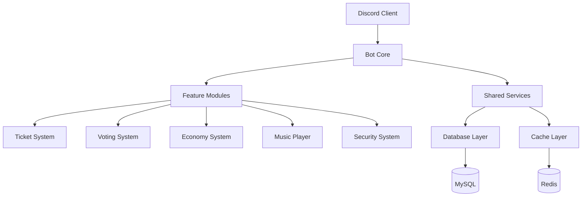

# 🥔 Potato Discord Bot

[](VERSION)
[](https://discord.com)
[](LICENSE)
[](docs/index.md)

> **企業級 Discord 社群管理機器人** - 現代化架構 • 功能完整 • 易於部署

## 🚀 快速開始

### 跨平台啟動

```bash
# Python 啟動器 (推薦)
python start.py

# Linux/macOS
./start.sh

# Windows
start.bat
```

### 環境配置

```bash
# 複製配置範例
cp .env.example .env

# 編輯配置文件
nano .env
```

## 📦 核心功能

### 🎫 智能客服系統
- 自動票券管理、SLA 監控
- 智能分類、自動路由
- 評分系統、工作流自動化

### 🗳️ 實時投票系統
- 動態結果更新、多種模式
- 權限控制、匿名投票
- 詳細統計報告

### 💰 虛擬經濟系統
- 積分獎勵、服務計費
- 每日獎勵、交易記錄
- 完整財務追蹤

### 🎵 音樂播放器
- YouTube 音樂播放
- 播放列表管理
- 音量控制和隊列管理

### 🖼️ 圖片工具
- 圖片處理和編輯
- Meme 生成器
- 多種濾鏡效果

### 👋 歡迎系統
- 自訂歡迎訊息
- 新成員自動角色
- 規則確認流程

### 🎁 抽獎系統
- 公平的隨機抽獎
- 多種抽獎模式
- 自動結果公佈

### 🔒 安全管理
- 用戶警告和禁言
- 自動審核
- 詳細日誌記錄

## 🏗️ 專案架構



### 分支策略
- **`develop`** - 開發整合分支 (當前)
- **`main`** - 生產穩定分支

## 📋 系統要求

### 運行環境
- Python 3.10+
- MySQL 或 SQLite
- Redis (可選)
- Discord Bot Token

### 開發環境
- Git
- pytest (測試框架)
- Python 虛擬環境

## 🛠️ 技術棧

- **Discord.py** - Discord API 整合
- **MySQL** - 主要資料庫
- **Redis** - 快取和會話管理
- **aiomysql** - 異步資料庫操作
- **aiohttp** - 異步 HTTP 客戶端

### 媒體處理
- **Pillow** - 圖片處理
- **yt-dlp** - YouTube 音訊下載
- **PyNaCl** - 音訊編碼

### 開發工具
- **pytest** - 測試框架
- **python-dotenv** - 環境變數管理
- **orjson** - 高效能 JSON 處理

## 🧪 測試

### 運行測試
```bash
# 完整測試套件
pytest

# 包含覆蓋率報告
pytest --cov=src --cov-report=html

# 端到端測試
pytest tests/e2e/ -v
```

### 測試類型
- **單元測試** - 核心功能測試
- **整合測試** - 組件間交互測試
- **端到端測試** - 完整功能流程測試

## 🛡️ 安全

### 安全檢查
```bash
# 靜態安全分析
bandit -r src/

# 依賴漏洞掃描
safety check
pip-audit
```

### 安全特性
- 環境變數保護敏感資訊
- 嚴格的輸入驗證
- 基於角色的權限控制
- 完整的安全事件日誌
- 定期依賴更新

## 💻 開發指南

### 提交流程
1. 建立功能分支: `git checkout -b feature/xxx`
2. 開發和測試: `pytest`
3. 提交變更: `git commit -m "feat: xxx"`
4. 推送和建立 PR: `git push origin feature/xxx`

### 開發最佳實踐
- 遵循 PEP 8 代碼風格
- 為新功能編寫測試
- 更新相關文檔
- 使用有意義的提交訊息

## 📚 文檔

詳細文檔請參考：
- [用戶手冊](docs/user-guide/USER_MANUAL.md) - 功能使用說明
- [管理指南](docs/administration/README.md) - 部署和管理
- [故障排除](docs/user-guide/troubleshooting.md) - 常見問題解決

## 🤝 貢獻

歡迎提交 Issue 和 Pull Request！

### 開發流程
1. Fork 專案
2. 建立功能分支
3. 進行開發和測試
4. 提交 Pull Request
5. 代碼審查
6. 合併到主分支

## 📄 授權

本專案採用 MIT 授權條款。

---

**📝 注意：** 這是開發分支，包含開發工具和測試框架。生產部署請參考部署文檔。
