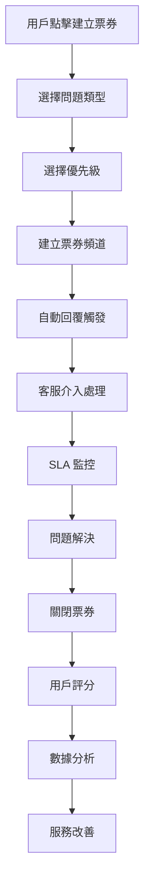

# 🎫 Discord 票券系統 v7.0

一個功能完整的 Discord 客服票券系統，支援多優先級管理、SLA 監控、自動回覆、評分系統等進階功能。

## ✨ 主要特色

### 🎯 智能化功能
- **🤖 自動回覆系統** - 基於關鍵字的智能自動回覆
- **🎯 智能分配系統** - 根據工作量、專精領域、在線狀態自動分配
- **⏰ SLA 監控** - 實時監控回應時間，自動超時提醒
- **📊 多維統計分析** - 客服效能、滿意度趨勢、實時數據面板

### 🎨 用戶體驗
- **🔴🟡🟢 三級優先級系統** - 視覺化優先級管理，動態 SLA 時間
- **⭐ 五星評分系統** - 完整的服務質量評估和回饋收集
- **🏷️ 動態標籤系統** - 靈活的票券分類和標記
- **🔍 強大搜尋功能** - 多維度票券搜尋和篩選

### 🛠️ 管理功能
- **👥 客服專精系統** - 專業領域匹配，提升服務質量
- **📋 回覆模板系統** - 快速回覆，提升工作效率
- **📈 實時監控面板** - SLA 達標率、客服工作量實時監控
- **🔄 批次操作工具** - 大量票券管理和維護

## 🏗️ 系統架構

```
bot/
├── cogs/
│   ├── ticket.py              # 主控制器（重構版）
│   └── ticket_listener.py     # 事件監聽器
├── db/
│   ├── pool.py               # 資料庫連接池
│   └── ticket_dao.py         # 資料操作層
├── views/
│   └── ticket_views.py       # UI 組件
├── utils/
│   ├── ticket_utils.py       # 工具函數
│   ├── ticket_constants.py   # 常數定義
│   ├── ticket_validators.py  # 驗證器（建議新增）
│   └── debug.py             # 除錯工具
├── services/
│   └── ticket_service.py     # 業務邏輯服務層（建議新增）
└── shared/
    └── config.py            # 共用設定
```

## 🚀 快速開始

### 1. 環境準備

```bash
# 安裝依賴
pip install discord.py aiomysql python-dotenv

# 設定環境變數
cp .env.example .env
```

### 2. 環境變數設定

```env
# Discord 設定
DISCORD_TOKEN=your_bot_token_here

# 資料庫設定
DB_HOST=localhost
DB_PORT=3306
DB_USER=your_db_user
DB_PASSWORD=your_db_password
DB_NAME=discord_bot

# 票券系統功能開關（可選）
TICKET_AUTO_ASSIGNMENT=true
TICKET_SLA_MONITORING=true
TICKET_AUTO_REPLIES=true
TICKET_RATING_SYSTEM=true
TICKET_ADVANCED_STATS=true
TICKET_TEMPLATE_SYSTEM=true
TICKET_TAG_SYSTEM=true
TICKET_EXPORT_SYSTEM=false
TICKET_BACKUP_SYSTEM=false

# 票券系統參數（可選）
TICKET_DEFAULT_SLA_MINUTES=60
TICKET_DEFAULT_AUTO_CLOSE_HOURS=24
TICKET_MAX_PER_USER=3
TICKET_DEBUG=false
```

### 3. 資料庫初始化

系統會在首次啟動時自動建立所需的資料表：

- `tickets` - 票券主表
- `ticket_settings` - 系統設定表
- `ticket_responses` - SLA 回應記錄表
- `ticket_views` - 票券查看記錄表
- `ticket_logs` - 操作日誌表
- `ticket_templates` - 回覆模板表
- `auto_reply_rules` - 自動回覆規則表
- `auto_reply_logs` - 自動回覆日誌表
- `staff_specialties` - 客服專精表
- `ticket_statistics_cache` - 統計快取表
- `notification_preferences` - 通知偏好表

### 4. 基本設定

```python
# 在你的 main.py 中載入票券系統
async def load_extensions():
    await bot.load_extension('bot.cogs.ticket')
    await bot.load_extension('bot.listeners.ticket_listener')
```

## 🎮 指令清單

### 📋 基礎功能

| 指令 | 描述 | 權限 |
|------|------|------|
| `!setup_ticket` | 建立票券互動面板 | 管理員 |
| `/close [reason] [request_rating]` | 關閉票券 | 票券創建者/客服 |
| `/ticket_info <id>` | 查詢票券詳情 | 票券創建者/客服 |
| `/tickets [status] [user] [priority]` | 分頁查詢票券 | 所有用戶 |

### ⚡ 優先級與指派

| 指令 | 描述 | 權限 |
|------|------|------|
| `/ticket_priority <priority> [ticket_id]` | 設定優先級 | 客服 |
| `/ticket_assign <user> [ticket_id]` | 指派票券 | 客服 |
| `/ticket_rating <ticket_id> <rating> [feedback]` | 評分系統 | 票券創建者 |

### 📊 統計與監控

| 指令 | 描述 | 權限 |
|------|------|------|
| `/ticket_admin` | 管理員控制面板 | 管理員 |
| `/sla_dashboard` | SLA 監控面板 | 管理員 |
| `/staff_stats [period] [user]` | 客服工作量統計 | 管理員 |

### 🔍 搜尋與標籤

| 指令 | 描述 | 權限 |
|------|------|------|
| `/ticket_search <keyword> [type]` | 搜尋票券 | 所有用戶 |
| `/ticket_tag <action> [ticket_id] [tags]` | 標籤管理 | 客服 |

### ⚙️ 系統設定

| 指令 | 描述 | 權限 |
|------|------|------|
| `/ticket_setting <setting> [value]` | 系統設定 | 管理員 |

#### 可設定項目：

- **category** - 票券分類頻道
- **support_roles** - 客服身分組（支援多個）
- **welcome** - 自訂歡迎訊息
- **limits** - 每人票券上限 (1-20)
- **auto_close** - 自動關閉時間（小時，1-168）
- **sla_response** - SLA 目標回應時間（分鐘，5-1440）
- **log_channel** - 操作日誌頻道
- **sla_alert_channel** - SLA 警告頻道

## 🎨 UI 組件

### 用戶介面
- **TicketView** - 主要票券建立面板
- **PrioritySelectForCreation** - 建立時優先級選擇
- **TicketControlView** - 票券控制面板
- **RatingView** - 評分系統介面
- **ConfirmCloseView** - 關閉確認對話框

### 管理介面
- **AdminPanelView** - 管理員控制面板
- **SLADashboardView** - SLA 監控面板
- **TicketPaginationView** - 分頁瀏覽
- **PriorityChangeView** - 優先級變更介面

## 🔒 權限系統

### 三層權限架構

1. **👤 一般用戶**
   - 建立票券
   - 查看自己的票券
   - 關閉自己的票券
   - 為已關閉票券評分

2. **🎫 客服人員**
   - 處理所有票券
   - 指派票券
   - 變更優先級
   - 查看統計資料
   - 使用回覆模板

3. **👑 管理員**
   - 完整系統設定
   - SLA 監控面板
   - 客服工作量統計
   - 批次操作
   - 系統診斷

## 📊 統計功能

### SLA 監控
- 📈 實時 SLA 達標率監控
- ⚠️ 自動超時警告
- 📊 按優先級分類的統計
- 👥 客服個人 SLA 表現

### 客服統計
- 📋 處理票券數量
- ⏱️ 平均處理時間
- ⭐ 平均評分
- 🎯 SLA 達標率

### 滿意度分析
- ⭐ 整體滿意度趨勢
- 📈 評分分布統計
- 💬 用戶回饋收集
- 🏆 優秀客服排行

## 🎯 優先級系統

### 三級優先級

| 優先級 | 表情 | SLA 倍數 | 適用情況 |
|--------|------|----------|----------|
| 🔴 高優先級 | 🔴 | 0.5x | 緊急問題、系統故障、安全問題 |
| 🟡 中優先級 | 🟡 | 1.0x | 一般問題、功能諮詢 |
| 🟢 低優先級 | 🟢 | 1.5x | 建議回饋、非緊急問題 |

### 自動 SLA 調整
- 高優先級：SLA 時間減半
- 中優先級：SLA 時間不變
- 低優先級：SLA 時間增加 50%

## 🤖 自動化功能

### 自動回覆系統
```python
# 預設自動回覆規則
AUTO_REPLY_RULES = [
    {
        "keywords": ["FAQ", "常見問題", "幫助"],
        "reply": "你可以查看我們的常見問題頁面..."
    },
    {
        "keywords": ["密碼", "登入", "password"],
        "reply": "如果你忘記密碼，可以使用忘記密碼功能..."
    }
]
```

### 自動分配算法
- **⚖️ 最少工作量** - 分配給當前工作量最少的客服
- **🔄 輪流分配** - 依序輪流分配給客服人員
- **🎯 專精匹配** - 根據客服專精領域智能分配
- **🎲 隨機分配** - 隨機分配給在線客服

## 📋 工作流程

### 完整票券生命週期



### 1. 票券建立流程
1. 用戶在面板選擇問題類型
2. 選擇問題優先級
3. 系統建立專屬頻道
4. 自動回覆檢查（可選）
5. 自動分配客服（可選）

### 2. 處理流程
1. 客服接收通知
2. 首次回應（SLA 監控開始）
3. 問題處理對話
4. 必要時變更優先級或轉移

### 3. 關閉流程
1. 客服或用戶關閉票券
2. 系統記錄處理時間
3. 邀請用戶評分
4. 頻道延遲刪除
5. 統計數據更新

## 📈 監控和分析

### SLA 監控面板
```
📈 SLA 監控面板
├── 📊 本週統計
│   ├── 總票券：156
│   ├── 達標：134 (85.9%)
│   ├── 超時：22
│   └── 平均回應：45.2 分鐘
├── ⚠️ 當前超時
│   ├── 🔴 高優先級：3
│   ├── 🟡 中優先級：8
│   └── 🟢 低優先級：5
└── 👥 客服表現 TOP5
    ├── Alice: 92.3%
    ├── Bob: 88.7%
    └── Charlie: 85.1%
```

### 客服統計面板
```
👤 客服工作統計 - 本週
├── 📊 處理統計
│   ├── 處理票券：45 張
│   ├── 關閉票券：42 張
│   ├── 平均處理時間：2.3 小時
│   └── SLA 達標率：88.9%
└── ⭐ 評分統計
    ├── 平均評分：4.6/5
    ├── 5星評價：28 次
    └── 評分總數：35 次
```

## 🎛️ 設定範例

### 基本設定
```bash
# 設定票券分類頻道
/ticket_setting category #客服中心

# 設定客服身分組（支援多個）
/ticket_setting support_roles @客服 @資深客服 @客服主管

# 設定每人票券上限
/ticket_setting limits 5

# 設定自動關閉時間（48小時）
/ticket_setting auto_close 48

# 設定 SLA 目標時間（30分鐘）
/ticket_setting sla_response 30
```

### 進階設定
```bash
# 自訂歡迎訊息
/ticket_setting welcome "歡迎使用我們的客服系統！請詳細描述你的問題。"

# 設定日誌頻道
/ticket_setting log_channel #客服日誌

# 設定 SLA 警告頻道
/ticket_setting sla_alert_channel #sla-警告
```

## 🔧 技術規格

### 資料庫需求
- **MySQL 8.0+** 或 **MariaDB 10.5+**
- 支援 JSON 資料類型
- 建議啟用 InnoDB 儲存引擎

### 性能指標
- **回應時間**：< 200ms（一般操作）
- **併發支援**：1000+ 同時票券
- **快取效率**：95%+ 設定查詢命中率
- **記憶體使用**：< 100MB（中型伺服器）

### 擴展性
- **水平擴展**：支援資料庫讀寫分離
- **多伺服器**：完全獨立的伺服器設定
- **模組化**：可獨立啟用/停用功能
- **API 整合**：預留外部系統整合介面

## 🛡️ 安全特性

### 權限控制
- **細粒度權限**：三層權限架構
- **身分組整合**：與 Discord 身分組完全整合
- **操作審計**：完整的操作日誌記錄

### 資料安全
- **SQL 注入防護**：使用參數化查詢
- **輸入驗證**：嚴格的輸入格式驗證
- **敏感資料保護**：評分回饋等敏感資料加密

### 速率限制
- **用戶操作限制**：防止濫用
- **API 調用限制**：避免 Discord API 限制
- **資料庫連接池**：防止連接耗盡

## 📝 開發指南

### 新增票券類型
```python
# 在 ticket_constants.py 中添加
CUSTOM_TICKET_TYPES = [
    {
        "name": "VIP 客戶",
        "emoji": "👑",
        "style": discord.ButtonStyle.primary,
        "description": "VIP 客戶專屬服務",
        "priority": "high",
        "auto_tags": ["VIP", "優先"]
    }
]
```

### 自訂自動回覆規則
```python
# 使用管理指令或資料庫直接添加
await dao.create_auto_reply_rule(
    guild_id=guild_id,
    name="自訂規則",
    keywords=["關鍵字1", "關鍵字2"],
    reply="自動回覆內容",
    priority=1
)
```

### 擴展統計功能
```python
# 在 ticket_dao.py 中添加新的統計方法
async def get_custom_statistics(guild_id: int):
    # 自訂統計邏輯
    pass
```

## 🐛 故障排除

### 常見問題

**Q: 票券面板不顯示按鈕？**
A: 檢查機器人是否有 `SEND_MESSAGES` 和 `EMBED_LINKS` 權限

**Q: 無法建立票券頻道？**
A: 確認機器人有 `MANAGE_CHANNELS` 權限且分類頻道已正確設定

**Q: SLA 監控不工作？**
A: 檢查資料庫連接和 `TICKET_SLA_MONITORING` 環境變數

**Q: 自動回覆沒觸發？**
A: 確認 `TICKET_AUTO_REPLIES=true` 且已設定自動回覆規則

### 除錯模式
```env
# 啟用詳細日誌
TICKET_DEBUG=true
TICKET_VERBOSE_LOG=true
TICKET_SQL_LOG=true
```

### 性能調優
```env
# 調整快取時間
TICKET_CACHE_SETTINGS=300
TICKET_CACHE_STATS=180

# 調整分頁大小
TICKET_DEFAULT_PAGE_SIZE=5
TICKET_MAX_PAGE_SIZE=20
```

## 🔄 更新日誌

### v7.0 (當前版本)
- ✨ 完全重構架構，提升模組化程度
- 🎯 新增三級優先級系統
- 📊 強化 SLA 監控和統計功能
- 🤖 改善自動回覆和分配系統
- 🏷️ 新增標籤系統
- ⭐ 完善評分和回饋系統

### v6.0
- 🎨 UI 組件重新設計
- 📈 增加進階統計功能
- 🔍 強化搜尋功能

### v5.0
- 🤖 引入自動分配系統
- ⏰ 新增 SLA 監控
- 📋 模板系統實現

## 🤝 貢獻指南

歡迎提交 Issue 和 Pull Request！

### 開發環境設定
```bash
# 複製專案
git clone <repository_url>
cd discord-ticket-system

# 安裝開發依賴
pip install -r requirements-dev.txt

# 執行測試
python -m pytest tests/

# 代碼風格檢查
black bot/
flake8 bot/
```

### 代碼規範
- 使用 **Black** 進行代碼格式化
- 遵循 **PEP 8** 代碼風格
- 添加適當的類型提示
- 編寫完整的文檔字符串

## 📄 授權

此專案採用 MIT 授權條款。

## 🙏 鳴謝

感謝所有貢獻者和使用者的回饋，讓這個系統不斷改進！

---

**🎫 讓客服工作更高效，讓用戶體驗更美好！**