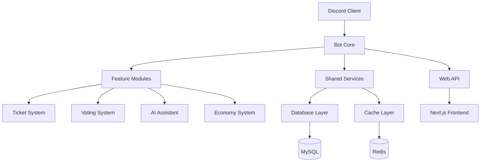

# 🥔 Potato Discord Bot

[](VERSION)
[](https://discord.com)
[](LICENSE)
[](https://github.com/actions)
[](#testing)
[](https://codecov.io/gh/Craig-0219/potato)
[](#security)
[](docs/index.md)

> **企業級 Discord 社群管理機器人** - 現代化架構 • AI 整合 • Web 管理介面

## 🚀 快速開始

### 跨平台啟動

```bash
# Python 啟動器 (推薦)
python start.py

# Linux/macOS
./start.sh

# Windows
start.bat
```

### 環境配置

```bash
# 複製配置範例
cp .env.example .env

# 編輯配置文件
nano .env
```

## 📦 核心功能

=== "🎫 **智能客服系統**"
    - 自動票券管理、SLA 監控
    - 智能分類、自動路由
    - 評分系統、工作流自動化

=== "🤖 **AI 整合平台**"
    - 多平台支援 (OpenAI、Anthropic、Gemini)
    - 智能對話、內容審核
    - 用量管理、成本控制

=== "🗳️ **實時投票系統**"
    - 動態結果更新、多種模式
    - 權限控制、匿名投票
    - 詳細統計報告

=== "💰 **虛擬經濟系統**"
    - 積分獎勵、服務計費
    - 每日獎勵、交易記錄
    - 完整財務追蹤

=== "🌐 **Web 管理介面**"
    - 現代化 Next.js 前端
    - 實時數據監控
    - 直觀配置管理

## 🏗️ 專案架構



### 分支策略
- **`feature/*`** - 功能開發分支
- **`develop`** - 開發整合分支 (當前)
- **`main`** - 生產穩定分支
- **`ptero`** - 部署分支 (純淨版)

## 🔄 CI/CD 流程

### GitHub Actions 工作流程

1. **🤖 Auto Merge** - 自動合併
   - PR 標籤檢測 (`auto-merge`)
   - 自動代碼審查驗證
   - 條件滿足時自動合併

2. **🧠 Smart Change Detection** - 智能變更檢測
   - 自動分析變更類型和影響範圍
   - 動態調整後續檢查策略
   - 節省 40-60% 執行時間

3. **🛡️ Code Quality** - 代碼品質檢查
   - Black 代碼格式化檢查
   - isort 導入排序檢查
   - Flake8 代碼風格檢查
   - 品質報告生成

4. **🧪 Test Coverage** - 測試覆蓋率
   - pytest 測試套件執行
   - 覆蓋率報告生成
   - Codecov 整合

5. **🛡️ Security Scans** - 安全掃描
   - Bandit 靜態安全分析
   - Semgrep 進階安全掃描
   - Safety 依賴漏洞掃描
   - pip-audit 套件安全檢查

6. **🚀 Production Deployment** - 生產部署
   - 自動化部署到 ptero 分支
   - 部署前合規檢查
   - 自動版本標籤創建

### 部署流程

- develop → main: 穩定功能合併到生產分支
- main → ptero: 自動部署到託管服務

### 分支策略
- **只允許 develop → main** - 嚴格的分支保護規則
- **feature/* → develop** - 功能開發流程
- **main** - 僅包含生產級別文件

## 📋 系統要求

### 運行環境
- Python 3.10+
- PostgreSQL 或 SQLite
- Redis (可選)
- Discord Bot Token

### 開發環境
- Git
- pytest (測試框架)
- ruff (代碼格式化和檢查)
- coverage (測試覆蓋率)

## 🛠️ 技術棧

- **Discord.py** - Discord API 整合
- **FastAPI** - 現代 Web API 框架
- **PostgreSQL** - 主要資料庫
- **Redis** - 快取和會話管理
- **Prometheus** - 監控和指標

### 開發工具
- **Black/isort/Flake8** - Python 代碼格式化和檢查
- **pytest** - 測試框架
- **Coverage** - 測試覆蓋率分析
- **Bandit/Semgrep** - 安全漏洞掃描
- **GitHub Actions** - CI/CD 自動化

## 🧪 測試 {#testing}

### 運行測試
```bash
# 完整測試套件
pytest

# 包含覆蓋率報告
pytest --cov=bot --cov=shared --cov-report=html

# E2E 測試
pytest tests/e2e/ -v
```

### 測試類型
- **單元測試** - 核心功能測試
- **整合測試** - 組件間交互測試
- **E2E 測試** - 端到端功能測試

## 🛡️ 安全 {#security}

### 安全檢查
```bash
# 靜態安全分析
bandit -r bot/ shared/

# 依賴漏洞掃描
safety check
pip-audit

# 進階安全掃描
semgrep --config=auto bot/ shared/
```

### 安全特性
- Bandit 靜態安全分析
- Semgrep 進階安全掃描
- 依賴漏洞監控 (Safety + pip-audit)
- CI/CD 整合安全檢查

## 💻 開發指南

### 提交流程
1. 建立功能分支: `git checkout -b feature/xxx`
2. 開發和測試: `pytest`
3. 代碼品質檢查: `black . && isort . && flake8 .`
4. 提交變更: `git commit -m "feat: xxx"`
5. 推送和建立 PR: `git push origin feature/xxx`

### CI/CD 流程
- PR 觸發完整檢查流程 (Auto-merge 可用)
- 智能變更檢測優化執行時間
- 自動化代碼品質和安全檢查
- 測試覆蓋率驗證和 Codecov 整合
- develop → main → ptero 自動部署

---

**📝 注意：** 這是開發分支，包含完整的 CI/CD 流程和測試框架。生產部署請使用 `main` 分支。 
