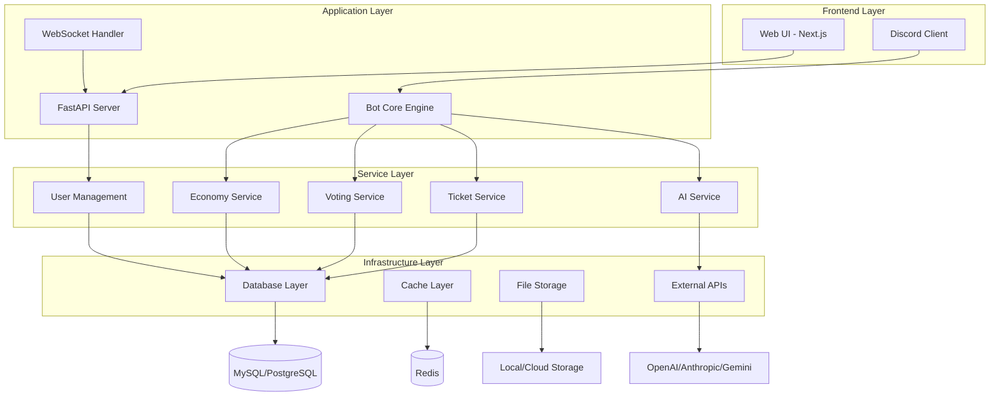

# 🥔 Potato Bot

<div align="center">

[](VERSION)
[](https://discord.com)
[](LICENSE)
[](https://github.com/actions)
[](#testing)
[](https://codecov.io/gh/Craig-0219/potato)
[](#security)
[](docs/index.md)

**全功能 Discord 社群管理機器人**

*現代化架構 • AI 整合 • Web 管理介面*

</div>

## 📖 目錄

- [🚀 快速開始](#-快速開始)
- [📦 核心功能](#-核心功能)
- [🏗️ 專案架構](#️-專案架構)
- [📋 系統要求](#-系統要求)
- [⚙️ 環境配置](#️-環境配置)
- [💻 開發指南](#-開發指南)
- [🚀 部署指南](#-部署指南)
- [🧪 測試](#-測試)
- [🛡️ 安全](#️-安全)
- [📚 文檔](#-文檔)
</div>

## 🚀 快速開始

### 一鍵啟動

```bash
# 跨平台 Python 啟動器 (推薦)
python start.py

# Linux/macOS
chmod +x start.sh && ./start.sh

# Windows
start.bat
```

### 基本設置

```bash
# 1. 複製配置範例
cp .env.example .env

# 2. 編輯必要配置
nano .env
# 設定 DISCORD_TOKEN、DB_* 等必要變數

# 3. 安裝依賴
pip install -r requirements.txt

# 4. 啟動機器人
python start.py
```

## 📦 核心功能

### 🎫 智能客服系統
- **自動票券管理** - 智能分類、自動路由、SLA 監控
- **評分系統** - 服務品質評估、用戶回饋收集
- **工作流自動化** - 自定義處理流程、自動回覆
- **統計分析** - 詳細報告、效能追蹤

### 🤖 AI 整合平台
- **多平台支援** - OpenAI、Anthropic、Gemini 整合
- **智能對話** - 上下文感知、情感分析
- **內容審核** - 自動檢測不當內容
- **用量管理** - 配額限制、成本控制、用戶限制

### 🗳️ 實時投票系統
- **多種投票模式** - 單選、多選、排序投票
- **動態結果更新** - 即時統計、圖表顯示
- **權限控制** - 角色限制、匿名投票
- **資料分析** - 詳細統計報告、趨勢分析

### 💰 虛擬經濟系統
- **積分系統** - 獎勵機制、消費記錄
- **服務計費** - 功能使用成本計算
- **每日獎勵** - 活躍度激勵機制
- **財務追蹤** - 完整交易記錄、報表生成

### 🌐 Web 管理介面
- **現代化前端** - Next.js 響應式設計
- **實時監控** - 系統狀態、用戶活動
- **配置管理** - 直觀的設定界面
- **數據視覺化** - 圖表、統計面板

## 🏗️ 專案架構



### 技術棧

| 層級 | 技術 | 版本 | 用途 |
|------|------|------|------|
| **Discord Bot** | discord.py | 2.5.2+ | Discord API 整合 |
| **Web API** | FastAPI | 0.110.0+ | RESTful API 服務 |
| **資料庫** | MySQL/PostgreSQL | 8.0+/13+ | 主要資料存儲 |
| **快取** | Redis | 7.0+ | 效能優化、會話管理 |
| **AI 服務** | OpenAI/Anthropic/Gemini | Latest | 智能功能支援 |
| **前端** | Next.js | 14+ | Web 管理介面 |

## 📋 系統要求

### 最低要求
- **Python**: 3.10+
- **記憶體**: 512MB RAM
- **儲存空間**: 2GB
- **網路**: 穩定的網際網路連線

### 推薦配置
- **Python**: 3.11+
- **記憶體**: 2GB+ RAM
- **儲存空間**: 10GB SSD
- **資料庫**: MySQL 8.0+ 或 PostgreSQL 13+
- **快取**: Redis 7.0+ (可選)

### 依賴服務
- **Discord Bot Token** (必需)
- **資料庫服務** (MySQL/PostgreSQL/SQLite)
- **AI API 金鑰** (可選)
- **Redis 服務** (可選，提升效能)

## ⚙️ 環境配置

### 必要配置

```bash
# Discord 設定
DISCORD_TOKEN=your_discord_bot_token_here
DISCORD_GUILD_ID=your_discord_server_id

# 資料庫配置
DB_HOST=localhost
DB_PORT=3306
DB_USER=your_database_username
DB_PASSWORD=your_secure_password
DB_NAME=potato_bot

# API 服務
API_HOST=0.0.0.0
API_PORT=8000
JWT_SECRET=your_jwt_secret_key_at_least_32_characters_long
```

### 可選配置

```bash
# Redis 快取 (效能優化)
REDIS_URL=redis://localhost:6379/0

# AI 服務
OPENAI_API_KEY=your_openai_api_key
ANTHROPIC_API_KEY=your_anthropic_api_key
GEMINI_API_KEY=your_gemini_api_key

# 功能開關
TICKET_AUTO_ASSIGNMENT=true
ECONOMY_ENABLED=true
CONTENT_ANALYSIS_ENABLED=true

# 環境設定
NODE_ENV=production  # development/production
LOG_LEVEL=INFO       # DEBUG/INFO/WARNING/ERROR
```

完整配置說明請參考 [.env.example](.env.example)

## 💻 開發指南

### 開發環境設置

```bash
# 1. Clone 專案
git clone https://github.com/your-repo/potato.git
cd potato

# 2. 建立虛擬環境
python -m venv venv
source venv/bin/activate  # Linux/macOS
# 或
venv\Scripts\activate     # Windows

# 3. 安裝開發依賴
pip install -r requirements.txt

# 4. 設置 pre-commit hooks
pip install pre-commit
pre-commit install

# 5. 複製並配置環境檔案
cp .env.example .env
# 編輯 .env 填入實際配置
```

### 代碼品質工具

```bash
# 格式化代碼
black bot/ shared/
isort bot/ shared/

# 代碼風格檢查
flake8 bot/ shared/

# 安全掃描
bandit -r bot/ shared/

# 依賴漏洞檢查
safety check
pip-audit
```

### 提交流程

1. **建立功能分支**
   ```bash
   git checkout -b feature/your-feature-name
   ```

2. **開發和測試**
   ```bash
   pytest                    # 運行測試
   pytest --cov             # 包含覆蓋率
   ```

3. **代碼品質檢查**
   ```bash
   black . && isort . && flake8 .
   ```

4. **提交變更**
   ```bash
   git add .
   git commit -m "feat: your feature description"
   ```

5. **推送和建立 PR**
   ```bash
   git push origin feature/your-feature-name
   ```

## 🚀 部署指南

### 本地部署

```bash
# 使用內建啟動器
python start.py

# 手動啟動
python -m bot.main
```

### Docker 部署

```bash
# 使用 Docker Compose
docker-compose up -d

# 手動建置
docker build -t potato-bot .
docker run -d --env-file .env potato-bot
```

### 生產部署

詳細部署指南請參考：
- [📖 部署文檔](docs/deployment/README.md)
- [🐳 Docker 部署](docs/deployment/docker-quick.md)
- [☁️ 雲端部署](docs/deployment/vps-deployment.md)

## 🧪 測試

### 運行測試

```bash
# 全部測試
pytest

# 特定測試類型
pytest tests/unit/           # 單元測試
pytest tests/integration/    # 整合測試
pytest tests/e2e/           # 端到端測試
```

### 測試覆蓋率

目標覆蓋率：85%+
- 單元測試：90%+
- 整合測試：80%+
- 端到端測試：70%+

## 🛡️ 安全

### 安全檢查

```bash
# 安全掃描
bandit -r bot/ shared/

# 依賴漏洞檢查
safety check
pip-audit
完整配置說明請參考 [.env.example](.env.example)

## 🧪 測試

### 運行測試

```bash
# 全部測試
pytest

# 特定測試類型
pytest tests/unit/           # 單元測試
pytest tests/integration/    # 整合測試
pytest tests/e2e/           # 端到端測試
```

### 測試覆蓋率

目標覆蓋率：85%+
- 單元測試：90%+
- 整合測試：80%+
- 端到端測試：70%+

## 🛡️ 安全

### 安全檢查

```bash
# 安全掃描
bandit -r bot/ shared/

# 依賴漏洞檢查
safety check
pip-audit
```

### 安全最佳實踐

- ✅ **環境變數** - 敏感資訊使用環境變數存儲
- ✅ **API 金鑰** - 定期輪換 API 金鑰
- ✅ **輸入驗證** - 嚴格的用戶輸入驗證
- ✅ **權限控制** - 基於角色的存取控制
- ✅ **日誌記錄** - 安全事件完整記錄
- ✅ **依賴更新** - 定期更新依賴套件

## 📚 文檔

### 用戶文檔
- [📖 使用者手冊](docs/user-guide/USER_MANUAL.md)
- [🎮 指令列表](docs/user-guide/commands.md)
- [🎫 票券系統](docs/user-guide/ticket-system.md)
- [🗳️ 投票系統](docs/user-guide/features/voting-system.md)
- [🤖 AI 助手](docs/user-guide/ai-assistant.md)

### 開發文檔
- [🏗️ 專案架構](docs/development/architecture.md)
- [🔧 API 文檔](docs/development/api-reference.md)
- [🧪 測試指南](docs/development/testing.md)
- [🔒 安全指南](docs/development/security.md)

### 部署文檔
- [🚀 快速部署](docs/deployment/quick-start.md)
- [🐳 Docker 部署](docs/deployment/docker-quick.md)
- [☁️ 雲端部署](docs/deployment/vps-deployment.md)
- [🛠️ 故障排除](docs/deployment/troubleshooting.md)

## 🤝 貢獻指南

我們歡迎社群貢獻！請閱讀 [貢獻指南](CONTRIBUTING.md) 了解如何參與開發。

### 開發流程
1. Fork 專案
2. 建立功能分支
3. 進行開發和測試
4. 提交 Pull Request
5. 代碼審查
6. 合併到主分支

## 📞 支援與社群

- 🐛 **問題回報**: [GitHub Issues](https://github.com/Craig-0219/potato/issues)
- 💬 **社群討論**: [Discord 伺服器](https://discord.gg/your-server)
- 📧 **聯絡我們**: support@potato-bot.com
- 📖 **文檔網站**: [potato-bot.readthedocs.io](https://potato-bot.readthedocs.io)

## 📄 授權

本專案使用 [MIT 授權](LICENSE)。

---

<div align="center">

**準備開始了嗎？** 🚀

[快速開始](#-快速開始) • [查看文檔](docs/index.md) • [部署指南](docs/deployment/README.md) • [生產環境配置](README.prod.md)

*如需更多開發和生產環境的詳細資訊，請參閱 README.dev.md 和 README.prod.md*

</div>
