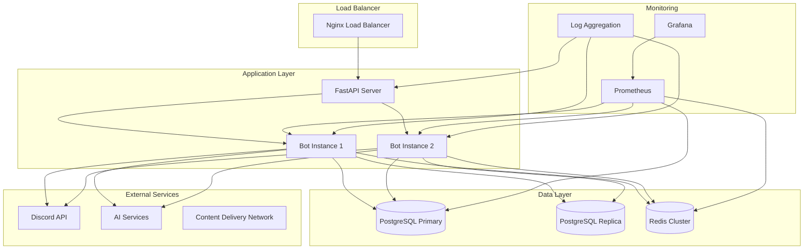

# 🥔 Potato Bot - 生產環境部署指南

<div align="center">

[](https://github.com/Craig-0219/potato)
[](https://status.potato-bot.com)
[](#安全性配置)
[](#效能優化)
[](#監控系統)

**全方位生產環境部署指南**

*高可用性 • 安全性 • 效能優化 • 監控告警*

</div>

## 📖 生產環境目錄

- [🎯 部署概覽](#-部署概覽)
- [⚙️ 系統要求](#️-系統要求)
- [🔧 生產環境配置](#-生產環境配置)
- [🐳 Docker 部署](#-docker-部署)
- [☁️ 雲端部署](#️-雲端部署)
- [🛡️ 安全性配置](#️-安全性配置)
- [🚀 效能優化](#-效能優化)
- [📊 監控系統](#-監控系統)
- [💾 備份與恢復](#-備份與恢復)
- [🔄 維護與更新](#-維護與更新)

## 🎯 部署概覽

### 生產環境架構



### 部署檢查清單

#### 部署前檢查
- [ ] 環境變數配置完成
- [ ] SSL 憑證安裝
- [ ] 資料庫遷移執行
- [ ] 防火牆規則設定
- [ ] 監控系統配置
- [ ] 備份策略實施
- [ ] 負載均衡設定

#### 部署後驗證
- [ ] 服務健康檢查通過
- [ ] API 端點正常回應
- [ ] Discord 機器人上線
- [ ] 資料庫連線正常
- [ ] Redis 快取運作
- [ ] 監控警報測試
- [ ] 效能基準測試

## ⚙️ 系統要求

### 最低生產要求

```yaml
# 單一實例配置
CPU: 4 核心 (2.4GHz+)
RAM: 8GB
Storage: 50GB SSD
Network: 1Gbps
OS: Ubuntu 20.04+ / CentOS 8+ / RHEL 8+
```

### 推薦生產配置

```yaml
# 高可用性配置
Load Balancer:
  CPU: 2 核心
  RAM: 4GB
  
Application Servers (2 instances):
  CPU: 8 核心 (3.0GHz+)
  RAM: 16GB
  Storage: 100GB NVMe SSD
  
Database Server:
  CPU: 16 核心 (3.2GHz+)
  RAM: 32GB
  Storage: 500GB NVMe SSD (RAID 1)
  
Redis Cluster:
  CPU: 4 核心
  RAM: 16GB
  Storage: 100GB SSD
  
Monitoring Server:
  CPU: 4 核心
  RAM: 8GB
  Storage: 200GB SSD
```

### 網路要求

```yaml
Bandwidth:
  Minimum: 100Mbps
  Recommended: 1Gbps
  
Latency:
  Discord API: < 100ms
  AI Services: < 200ms
  Database: < 5ms (local)
  
Ports:
  HTTP: 80
  HTTPS: 443
  SSH: 22 (custom port recommended)
  PostgreSQL: 5432 (internal only)
  Redis: 6379 (internal only)
  Prometheus: 9090 (internal only)
  Grafana: 3000 (internal only)
```

## 🔧 生產環境配置

### 核心環境變數

```bash
# .env.production
# ======================
# 基本生產配置
# ======================

# 環境設定
NODE_ENV=production
ENVIRONMENT=production
DEBUG=false
LOG_LEVEL=INFO

# Discord 配置
DISCORD_TOKEN=your_production_bot_token
DISCORD_GUILD_ID=your_production_server_id
DISCORD_CLIENT_ID=your_discord_client_id
DISCORD_CLIENT_SECRET=your_discord_client_secret

# ======================
# 資料庫配置 (PostgreSQL)
# ======================
DB_HOST=postgres-primary.internal
DB_PORT=5432
DB_USER=potato_bot_prod
DB_PASSWORD=your_super_secure_production_password
DB_NAME=potato_bot_production
DB_SSL_MODE=require

# 讀取副本 (可選)
DB_READ_HOST=postgres-replica.internal
DB_READ_PORT=5432

# ======================
# Redis 配置
# ======================
REDIS_URL=redis://redis-cluster.internal:6379/0
REDIS_PASSWORD=your_redis_cluster_password
REDIS_SSL=true

# ======================
# API 服務配置
# ======================
API_HOST=0.0.0.0
API_PORT=8000
API_WORKERS=4
JWT_SECRET=your_jwt_secret_key_minimum_64_characters_for_production_security
JWT_EXPIRY=3600

# API 安全設定
API_RATE_LIMIT_PER_MINUTE=120
API_MAX_REQUEST_SIZE=5242880
API_CORS_ORIGINS=https://your-domain.com,https://api.your-domain.com

# ======================
# SSL/TLS 配置
# ======================
SSL_CERT_PATH=/etc/ssl/certs/your-domain.crt
SSL_KEY_PATH=/etc/ssl/private/your-domain.key
SSL_CA_PATH=/etc/ssl/certs/ca-certificates.crt

# ======================
# AI 服務配置
# ======================
OPENAI_API_KEY=your_production_openai_key
ANTHROPIC_API_KEY=your_production_anthropic_key
GEMINI_API_KEY=your_production_gemini_key

# AI 使用限制
AI_MAX_TOKENS=8000
AI_RATE_LIMIT_USER=50
AI_RATE_LIMIT_GUILD=500
AI_DAILY_FREE_QUOTA=100

# ======================
# 功能配置
# ======================

# 票券系統
TICKET_AUTO_ASSIGNMENT=true
TICKET_SLA_MONITORING=true
TICKET_ADVANCED_STATS=true
TICKET_DEFAULT_SLA_MINUTES=30
TICKET_MAX_PER_USER=5

# 經濟系統
ECONOMY_ENABLED=true
ECONOMY_STARTING_COINS=500
ECONOMY_DAILY_BONUS=50

# ======================
# 監控與日誌
# ======================
LOG_FILE_PATH=/var/log/potato-bot/app.log
LOG_MAX_SIZE=50MB
LOG_BACKUP_COUNT=10

# Sentry 錯誤追蹤
SENTRY_DSN=your_sentry_dsn_here
SENTRY_ENVIRONMENT=production

# Prometheus 監控
PROMETHEUS_ENABLED=true
PROMETHEUS_PORT=9090

# ======================
# 安全設定
# ======================

# 網路安全
ALLOWED_IPS=10.0.0.0/8,172.16.0.0/12,192.168.0.0/16
PROXY_TRUST_IPS=10.0.0.0/8

# 資料加密
ENCRYPTION_KEY=your_32_byte_base64_encoded_encryption_key
HASH_SALT_ROUNDS=12

# ======================
# 效能優化
# ======================
CONNECTION_POOL_SIZE=20
MAX_OVERFLOW=30
POOL_TIMEOUT=30
POOL_RECYCLE=3600

# 快取設定
CACHE_TTL=300
CACHE_MAX_SIZE=1000

# ======================
# 外部服務
# ======================
CDN_URL=https://cdn.your-domain.com
WEBHOOK_URL=https://your-domain.com/webhooks
BACKUP_STORAGE_URL=s3://your-backup-bucket
```

### 系統服務設定

#### Systemd 服務檔案

```ini
# /etc/systemd/system/potato-bot.service
[Unit]
Description=Potato Discord Bot
After=network.target postgresql.service redis.service
Wants=postgresql.service redis.service

[Service]
Type=simple
User=potato-bot
Group=potato-bot
WorkingDirectory=/opt/potato-bot
Environment=PATH=/opt/potato-bot/venv/bin
ExecStart=/opt/potato-bot/venv/bin/python start.py
ExecReload=/bin/kill -HUP $MAINPID
Restart=always
RestartSec=10
StandardOutput=journal
StandardError=journal
SyslogIdentifier=potato-bot

# 安全設定
NoNewPrivileges=true
PrivateTmp=true
ProtectSystem=strict
ProtectHome=true
ReadWritePaths=/opt/potato-bot/logs /opt/potato-bot/data

# 資源限制
LimitNOFILE=65536
LimitNPROC=32768

[Install]
WantedBy=multi-user.target
```

#### Nginx 反向代理

```nginx
# /etc/nginx/sites-available/potato-bot
upstream potato_bot_api {
    server 127.0.0.1:8000;
    server 127.0.0.1:8001 backup;
    keepalive 32;
}

server {
    listen 80;
    server_name api.your-domain.com;
    return 301 https://$server_name$request_uri;
}

server {
    listen 443 ssl http2;
    server_name api.your-domain.com;

    # SSL 配置
    ssl_certificate /etc/ssl/certs/your-domain.crt;
    ssl_certificate_key /etc/ssl/private/your-domain.key;
    ssl_protocols TLSv1.2 TLSv1.3;
    ssl_ciphers ECDHE-RSA-AES256-GCM-SHA512:DHE-RSA-AES256-GCM-SHA512:ECDHE-RSA-AES256-GCM-SHA384;
    ssl_prefer_server_ciphers off;
    ssl_session_cache shared:SSL:10m;
    ssl_session_timeout 10m;

    # 安全標頭
    add_header Strict-Transport-Security "max-age=63072000; includeSubDomains; preload";
    add_header X-Content-Type-Options nosniff;
    add_header X-Frame-Options DENY;
    add_header X-XSS-Protection "1; mode=block";

    # API 反向代理
    location /api/ {
        proxy_pass http://potato_bot_api/;
        proxy_http_version 1.1;
        proxy_set_header Upgrade $http_upgrade;
        proxy_set_header Connection 'upgrade';
        proxy_set_header Host $host;
        proxy_set_header X-Real-IP $remote_addr;
        proxy_set_header X-Forwarded-For $proxy_add_x_forwarded_for;
        proxy_set_header X-Forwarded-Proto $scheme;
        proxy_cache_bypass $http_upgrade;
        
        # 超時設定
        proxy_connect_timeout 60s;
        proxy_send_timeout 60s;
        proxy_read_timeout 60s;
    }

    # 健康檢查
    location /health {
        proxy_pass http://potato_bot_api/health;
        access_log off;
    }

    # 靜態檔案
    location /static/ {
        alias /opt/potato-bot/static/;
        expires 1y;
        add_header Cache-Control "public, immutable";
    }
}
```

## 🐳 Docker 部署

### Docker Compose 生產配置

```yaml
# docker-compose.prod.yml
version: '3.8'

services:
  # 應用程式
  bot-primary:
    build:
      context: .
      dockerfile: Dockerfile.prod
    container_name: potato-bot-primary
    restart: unless-stopped
    environment:
      - NODE_ENV=production
      - INSTANCE_ID=primary
    env_file:
      - .env.production
    volumes:
      - ./logs:/app/logs
      - ./data:/app/data
    depends_on:
      - postgres-primary
      - redis
    networks:
      - potato-net
    healthcheck:
      test: ["CMD", "curl", "-f", "http://localhost:8000/health"]
      interval: 30s
      timeout: 10s
      retries: 3
      start_period: 40s

  bot-secondary:
    build:
      context: .
      dockerfile: Dockerfile.prod
    container_name: potato-bot-secondary
    restart: unless-stopped
    environment:
      - NODE_ENV=production
      - INSTANCE_ID=secondary
    env_file:
      - .env.production
    volumes:
      - ./logs:/app/logs
      - ./data:/app/data
    depends_on:
      - postgres-primary
      - redis
    networks:
      - potato-net

  # 資料庫主節點
  postgres-primary:
    image: postgres:15
    container_name: postgres-primary
    restart: unless-stopped
    environment:
      - POSTGRES_DB=potato_bot_production
      - POSTGRES_USER=potato_bot_prod
      - POSTGRES_PASSWORD_FILE=/run/secrets/postgres_password
    secrets:
      - postgres_password
    volumes:
      - postgres_data:/var/lib/postgresql/data
      - ./postgres/init:/docker-entrypoint-initdb.d
      - ./postgres/conf:/etc/postgresql/postgresql.conf
    command: postgres -c config_file=/etc/postgresql/postgresql.conf
    networks:
      - potato-net
    healthcheck:
      test: ["CMD-SHELL", "pg_isready -U potato_bot_prod"]
      interval: 30s
      timeout: 5s
      retries: 3

  # 資料庫副本
  postgres-replica:
    image: postgres:15
    container_name: postgres-replica
    restart: unless-stopped
    environment:
      - POSTGRES_DB=potato_bot_production
      - POSTGRES_USER=potato_bot_prod
      - POSTGRES_PASSWORD_FILE=/run/secrets/postgres_password
      - PGUSER=postgres
    secrets:
      - postgres_password
    volumes:
      - postgres_replica_data:/var/lib/postgresql/data
    networks:
      - potato-net
    depends_on:
      - postgres-primary

  # Redis 快取
  redis:
    image: redis:7-alpine
    container_name: redis-cache
    restart: unless-stopped
    command: redis-server --requirepass ${REDIS_PASSWORD} --maxmemory 1gb --maxmemory-policy allkeys-lru
    volumes:
      - redis_data:/data
    networks:
      - potato-net
    healthcheck:
      test: ["CMD", "redis-cli", "--raw", "incr", "ping"]
      interval: 30s
      timeout: 5s
      retries: 3

  # Nginx 負載均衡
  nginx:
    image: nginx:alpine
    container_name: nginx-lb
    restart: unless-stopped
    ports:
      - "80:80"
      - "443:443"
    volumes:
      - ./nginx/nginx.conf:/etc/nginx/nginx.conf
      - ./nginx/conf.d:/etc/nginx/conf.d
      - ./ssl:/etc/ssl
      - ./logs/nginx:/var/log/nginx
    depends_on:
      - bot-primary
      - bot-secondary
    networks:
      - potato-net

  # 監控服務
  prometheus:
    image: prom/prometheus:latest
    container_name: prometheus
    restart: unless-stopped
    command:
      - '--config.file=/etc/prometheus/prometheus.yml'
      - '--storage.tsdb.path=/prometheus'
      - '--web.console.libraries=/etc/prometheus/console_libraries'
      - '--web.console.templates=/etc/prometheus/consoles'
      - '--web.enable-lifecycle'
      - '--storage.tsdb.retention.time=15d'
    volumes:
      - ./monitoring/prometheus:/etc/prometheus
      - prometheus_data:/prometheus
    networks:
      - potato-net

  grafana:
    image: grafana/grafana:latest
    container_name: grafana
    restart: unless-stopped
    environment:
      - GF_SECURITY_ADMIN_PASSWORD=${GRAFANA_PASSWORD}
    volumes:
      - grafana_data:/var/lib/grafana
      - ./monitoring/grafana:/etc/grafana/provisioning
    networks:
      - potato-net
    depends_on:
      - prometheus

  # 日誌收集
  loki:
    image: grafana/loki:latest
    container_name: loki
    restart: unless-stopped
    command: -config.file=/etc/loki/local-config.yaml
    volumes:
      - ./monitoring/loki:/etc/loki
      - loki_data:/loki
    networks:
      - potato-net

volumes:
  postgres_data:
  postgres_replica_data:
  redis_data:
  prometheus_data:
  grafana_data:
  loki_data:

networks:
  potato-net:
    driver: bridge

secrets:
  postgres_password:
    file: ./secrets/postgres_password.txt
```

### 生產環境 Dockerfile

```dockerfile
# Dockerfile.prod
FROM python:3.11-slim

# 設定工作目錄
WORKDIR /app

# 安裝系統依賴
RUN apt-get update && apt-get install -y \
    curl \
    postgresql-client \
    && rm -rf /var/lib/apt/lists/*

# 建立應用程式使用者
RUN groupadd -r appuser && useradd -r -g appuser appuser

# 複製依賴檔案
COPY requirements.txt requirements-prod.txt ./

# 安裝 Python 依賴
RUN pip install --no-cache-dir -r requirements-prod.txt

# 複製應用程式程式碼
COPY . .

# 設定權限
RUN chown -R appuser:appuser /app && \
    mkdir -p /app/logs /app/data && \
    chown -R appuser:appuser /app/logs /app/data

# 切換到應用程式使用者
USER appuser

# 暴露端口
EXPOSE 8000

# 健康檢查
HEALTHCHECK --interval=30s --timeout=10s --start-period=5s --retries=3 \
    CMD curl -f http://localhost:8000/health || exit 1

# 啟動應用程式
CMD ["python", "start.py"]
```

## ☁️ 雲端部署

### AWS 部署架構

```yaml
# AWS 資源配置
VPC:
  CIDR: 10.0.0.0/16
  Subnets:
    Public: 10.0.1.0/24, 10.0.2.0/24
    Private: 10.0.3.0/24, 10.0.4.0/24
    Database: 10.0.5.0/24, 10.0.6.0/24

Load Balancer:
  Type: Application Load Balancer
  Scheme: Internet-facing
  Subnets: Public

EC2 Instances:
  Type: t3.large (2 vCPU, 8GB RAM)
  Count: 2 (Auto Scaling)
  Subnets: Private
  AMI: Amazon Linux 2

RDS:
  Engine: PostgreSQL 15
  Instance: db.t3.medium
  Multi-AZ: true
  Backup Retention: 7 days

ElastiCache:
  Engine: Redis 7
  Instance: cache.t3.micro
  Cluster Mode: enabled

S3:
  Buckets:
    - potato-bot-backups
    - potato-bot-logs
    - potato-bot-assets

CloudWatch:
  Logs: /aws/ec2/potato-bot
  Metrics: Custom metrics enabled
  Alarms: CPU, Memory, Disk, Network
```

### Terraform 配置範例

```hcl
# main.tf
terraform {
  required_providers {
    aws = {
      source  = "hashicorp/aws"
      version = "~> 5.0"
    }
  }
}

provider "aws" {
  region = var.aws_region
}

# VPC
resource "aws_vpc" "potato_bot" {
  cidr_block           = "10.0.0.0/16"
  enable_dns_hostnames = true
  enable_dns_support   = true

  tags = {
    Name = "potato-bot-vpc"
  }
}

# Internet Gateway
resource "aws_internet_gateway" "potato_bot" {
  vpc_id = aws_vpc.potato_bot.id

  tags = {
    Name = "potato-bot-igw"
  }
}

# Public Subnets
resource "aws_subnet" "public" {
  count                   = 2
  vpc_id                  = aws_vpc.potato_bot.id
  cidr_block              = "10.0.${count.index + 1}.0/24"
  availability_zone       = data.aws_availability_zones.available.names[count.index]
  map_public_ip_on_launch = true

  tags = {
    Name = "potato-bot-public-${count.index + 1}"
  }
}

# Private Subnets
resource "aws_subnet" "private" {
  count             = 2
  vpc_id            = aws_vpc.potato_bot.id
  cidr_block        = "10.0.${count.index + 3}.0/24"
  availability_zone = data.aws_availability_zones.available.names[count.index]

  tags = {
    Name = "potato-bot-private-${count.index + 1}"
  }
}

# Load Balancer
resource "aws_lb" "potato_bot" {
  name               = "potato-bot-alb"
  internal           = false
  load_balancer_type = "application"
  security_groups    = [aws_security_group.alb.id]
  subnets            = aws_subnet.public[*].id

  enable_deletion_protection = true
}

# Auto Scaling Group
resource "aws_autoscaling_group" "potato_bot" {
  name                = "potato-bot-asg"
  vpc_zone_identifier = aws_subnet.private[*].id
  target_group_arns   = [aws_lb_target_group.potato_bot.arn]
  health_check_type   = "ELB"
  
  min_size         = 1
  max_size         = 3
  desired_capacity = 2

  launch_template {
    id      = aws_launch_template.potato_bot.id
    version = "$Latest"
  }
}

# RDS Database
resource "aws_db_instance" "potato_bot" {
  identifier = "potato-bot-db"

  engine         = "postgres"
  engine_version = "15.4"
  instance_class = "db.t3.medium"

  allocated_storage     = 100
  max_allocated_storage = 1000
  storage_encrypted     = true

  db_name  = "potato_bot_production"
  username = var.db_username
  password = var.db_password

  vpc_security_group_ids = [aws_security_group.rds.id]
  db_subnet_group_name   = aws_db_subnet_group.potato_bot.name

  backup_retention_period = 7
  backup_window          = "03:00-04:00"
  maintenance_window     = "Sun:04:00-Sun:05:00"

  skip_final_snapshot = false
  final_snapshot_identifier = "potato-bot-db-final-snapshot"

  tags = {
    Name = "potato-bot-database"
  }
}
```

### Azure 部署範例

```yaml
# azure-pipelines.yml
trigger:
  branches:
    include:
      - main

pool:
  vmImage: 'ubuntu-latest'

variables:
  azureSubscription: 'potato-bot-subscription'
  resourceGroup: 'potato-bot-rg'
  containerRegistry: 'potatobotacr'
  imageName: 'potato-bot'

stages:
- stage: Build
  displayName: 'Build and Push Image'
  jobs:
  - job: Build
    displayName: 'Build Job'
    steps:
    - task: Docker@2
      displayName: 'Build and Push Image'
      inputs:
        containerRegistry: $(containerRegistry)
        repository: $(imageName)
        command: 'buildAndPush'
        Dockerfile: 'Dockerfile.prod'
        tags: |
          $(Build.BuildId)
          latest

- stage: Deploy
  displayName: 'Deploy to Production'
  dependsOn: Build
  jobs:
  - deployment: Deploy
    displayName: 'Deploy Job'
    environment: 'production'
    strategy:
      runOnce:
        deploy:
          steps:
          - task: AzureRmWebAppDeployment@4
            displayName: 'Deploy to Azure Container Instances'
            inputs:
              azureSubscription: $(azureSubscription)
              appType: 'webAppContainer'
              WebAppName: 'potato-bot-app'
              DockerNamespace: '$(containerRegistry).azurecr.io'
              DockerRepository: $(imageName)
              DockerImageTag: '$(Build.BuildId)'
```

## 🛡️ 安全性配置

### 防火牆規則

```bash
# UFW 防火牆配置
#!/bin/bash

# 重置防火牆規則
ufw --force reset

# 預設政策
ufw default deny incoming
ufw default allow outgoing

# SSH (自訂端口)
ufw allow 2222/tcp

# HTTP/HTTPS
ufw allow 80/tcp
ufw allow 443/tcp

# 內部服務 (僅限內網)
ufw allow from 10.0.0.0/8 to any port 5432    # PostgreSQL
ufw allow from 10.0.0.0/8 to any port 6379    # Redis
ufw allow from 10.0.0.0/8 to any port 9090    # Prometheus
ufw allow from 10.0.0.0/8 to any port 3000    # Grafana

# 啟用防火牆
ufw --force enable
```

### SSL/TLS 配置

```bash
#!/bin/bash
# SSL 憑證自動更新腳本

# Let's Encrypt 憑證獲取
certbot --nginx -d api.your-domain.com -d admin.your-domain.com \
  --email admin@your-domain.com \
  --agree-tos --non-interactive

# 設定自動更新
echo "0 12 * * * /usr/bin/certbot renew --quiet && systemctl reload nginx" | crontab -

# 測試憑證
certbot certificates
```

### 安全監控

```python
# security/monitor.py
import logging
import smtplib
from email.mime.text import MIMEText
from datetime import datetime, timedelta
import psutil
import requests

class SecurityMonitor:
    """安全監控系統"""
    
    def __init__(self, config):
        self.config = config
        self.logger = logging.getLogger(__name__)
    
    async def check_failed_logins(self):
        """檢查失敗登入嘗試"""
        # 檢查 /var/log/auth.log
        with open('/var/log/auth.log', 'r') as f:
            lines = f.readlines()
        
        failed_attempts = []
        for line in lines:
            if 'Failed password' in line:
                failed_attempts.append(line)
        
        if len(failed_attempts) > 10:  # 閾值
            await self.send_alert(f"檢測到 {len(failed_attempts)} 次失敗登入嘗試")
    
    async def check_system_resources(self):
        """檢查系統資源使用"""
        cpu_percent = psutil.cpu_percent(interval=1)
        memory_percent = psutil.virtual_memory().percent
        disk_percent = psutil.disk_usage('/').percent
        
        alerts = []
        if cpu_percent > 80:
            alerts.append(f"CPU 使用率過高: {cpu_percent}%")
        if memory_percent > 85:
            alerts.append(f"記憶體使用率過高: {memory_percent}%")
        if disk_percent > 90:
            alerts.append(f"硬碟使用率過高: {disk_percent}%")
        
        for alert in alerts:
            await self.send_alert(alert)
    
    async def check_service_health(self):
        """檢查服務健康狀態"""
        services = [
            ('Discord Bot', 'http://localhost:8000/health'),
            ('PostgreSQL', self._check_postgres),
            ('Redis', self._check_redis),
        ]
        
        for service_name, check in services:
            try:
                if isinstance(check, str):
                    response = requests.get(check, timeout=5)
                    if response.status_code != 200:
                        raise Exception(f"HTTP {response.status_code}")
                else:
                    await check()
            except Exception as e:
                await self.send_alert(f"{service_name} 服務異常: {e}")
    
    async def send_alert(self, message):
        """發送警報"""
        self.logger.critical(f"安全警報: {message}")
        
        # 發送郵件警報
        if self.config.get('email_alerts'):
            await self._send_email_alert(message)
        
        # 發送 Discord 警報
        if self.config.get('discord_webhook'):
            await self._send_discord_alert(message)
    
    async def _send_email_alert(self, message):
        """發送郵件警報"""
        msg = MIMEText(f"時間: {datetime.now()}\n訊息: {message}")
        msg['Subject'] = '[ALERT] Potato Bot 安全警報'
        msg['From'] = self.config['smtp_from']
        msg['To'] = self.config['alert_email']
        
        with smtplib.SMTP(self.config['smtp_server']) as server:
            server.starttls()
            server.login(self.config['smtp_user'], self.config['smtp_password'])
            server.send_message(msg)
```

### 資料加密

```python
# security/encryption.py
from cryptography.fernet import Fernet
from cryptography.hazmat.primitives import hashes
from cryptography.hazmat.primitives.kdf.pbkdf2 import PBKDF2HMAC
import base64
import os

class EncryptionManager:
    """資料加密管理器"""
    
    def __init__(self, password: bytes, salt: bytes = None):
        if salt is None:
            salt = os.urandom(16)
        
        kdf = PBKDF2HMAC(
            algorithm=hashes.SHA256(),
            length=32,
            salt=salt,
            iterations=100000,
        )
        key = base64.urlsafe_b64encode(kdf.derive(password))
        self.cipher = Fernet(key)
        self.salt = salt
    
    def encrypt(self, data: str) -> str:
        """加密資料"""
        return self.cipher.encrypt(data.encode()).decode()
    
    def decrypt(self, encrypted_data: str) -> str:
        """解密資料"""
        return self.cipher.decrypt(encrypted_data.encode()).decode()
    
    @classmethod
    def generate_key(cls) -> str:
        """生成新的加密金鑰"""
        return Fernet.generate_key().decode()

# 使用範例
encryption_manager = EncryptionManager(b"your-master-password")

# 加密敏感配置
encrypted_db_password = encryption_manager.encrypt("your_database_password")
encrypted_api_key = encryption_manager.encrypt("your_api_key")
```

## 🚀 效能優化

### 資料庫優化

```sql
-- PostgreSQL 效能優化設定

-- 連線池設定
ALTER SYSTEM SET max_connections = 100;
ALTER SYSTEM SET shared_buffers = '1GB';
ALTER SYSTEM SET effective_cache_size = '3GB';
ALTER SYSTEM SET work_mem = '16MB';
ALTER SYSTEM SET maintenance_work_mem = '256MB';

-- 查詢優化
ALTER SYSTEM SET random_page_cost = 1.1;
ALTER SYSTEM SET effective_io_concurrency = 200;

-- WAL 設定
ALTER SYSTEM SET wal_buffers = '16MB';
ALTER SYSTEM SET checkpoint_completion_target = 0.9;
ALTER SYSTEM SET max_wal_size = '1GB';
ALTER SYSTEM SET min_wal_size = '80MB';

-- 套用設定
SELECT pg_reload_conf();

-- 建立索引
CREATE INDEX CONCURRENTLY idx_tickets_user_id_status ON tickets(user_id, status);
CREATE INDEX CONCURRENTLY idx_tickets_created_at ON tickets(created_at);
CREATE INDEX CONCURRENTLY idx_votes_guild_id_active ON votes(guild_id, is_active);

-- 統計資料更新
ANALYZE;
```

### Redis 快取策略

```python
# cache/strategy.py
import redis.asyncio as redis
import json
import asyncio
from typing import Any, Optional
from datetime import timedelta

class CacheStrategy:
    """智能快取策略"""
    
    def __init__(self, redis_client: redis.Redis):
        self.redis = redis_client
    
    async def get_or_set(self, 
                        key: str, 
                        fetch_func: callable,
                        ttl: int = 300,
                        **kwargs) -> Any:
        """獲取快取或設定新值"""
        try:
            cached_value = await self.redis.get(key)
            if cached_value:
                return json.loads(cached_value)
        except Exception:
            pass
        
        # 快取未命中，獲取新值
        value = await fetch_func(**kwargs)
        
        try:
            await self.redis.setex(
                key, 
                ttl, 
                json.dumps(value, default=str)
            )
        except Exception:
            pass  # 快取設定失敗不影響業務
        
        return value
    
    async def invalidate_pattern(self, pattern: str):
        """批量清除快取"""
        keys = await self.redis.keys(pattern)
        if keys:
            await self.redis.delete(*keys)
    
    async def warm_up_cache(self):
        """預熱快取"""
        # 預載常用資料
        warming_tasks = [
            self._warm_user_data(),
            self._warm_guild_settings(),
            self._warm_ticket_stats(),
        ]
        
        await asyncio.gather(*warming_tasks, return_exceptions=True)
    
    async def _warm_user_data(self):
        """預熱用戶資料"""
        # 預載活躍用戶的資料
        pass
```

### 應用程式效能優化

```python
# performance/optimizer.py
import asyncio
import time
from functools import wraps
from typing import Dict, List
import psutil

class PerformanceOptimizer:
    """效能優化器"""
    
    def __init__(self):
        self.metrics = {}
        self.slow_queries = []
    
    def monitor_performance(self, threshold: float = 1.0):
        """效能監控裝飾器"""
        def decorator(func):
            @wraps(func)
            async def wrapper(*args, **kwargs):
                start_time = time.time()
                
                try:
                    result = await func(*args, **kwargs)
                    execution_time = time.time() - start_time
                    
                    # 記錄效能指標
                    self.metrics[func.__name__] = self.metrics.get(func.__name__, [])
                    self.metrics[func.__name__].append(execution_time)
                    
                    # 記錄慢查詢
                    if execution_time > threshold:
                        self.slow_queries.append({
                            'function': func.__name__,
                            'execution_time': execution_time,
                            'timestamp': time.time(),
                            'args': str(args)[:100],  # 限制長度
                        })
                    
                    return result
                    
                except Exception as e:
                    execution_time = time.time() - start_time
                    self.slow_queries.append({
                        'function': func.__name__,
                        'execution_time': execution_time,
                        'error': str(e),
                        'timestamp': time.time(),
                    })
                    raise
            
            return wrapper
        return decorator
    
    async def get_performance_report(self) -> Dict:
        """獲取效能報告"""
        return {
            'system': {
                'cpu_percent': psutil.cpu_percent(),
                'memory_percent': psutil.virtual_memory().percent,
                'disk_usage': psutil.disk_usage('/').percent,
            },
            'application': {
                'avg_response_times': {
                    func: sum(times) / len(times)
                    for func, times in self.metrics.items()
                },
                'slow_queries': self.slow_queries[-10:],  # 最近 10 個慢查詢
            }
        }
```

## 📊 監控系統

### Prometheus 指標

```python
# monitoring/metrics.py
from prometheus_client import Counter, Histogram, Gauge, start_http_server
import time
import psutil

# 定義指標
REQUEST_COUNT = Counter('http_requests_total', 'Total HTTP requests', ['method', 'endpoint', 'status'])
REQUEST_DURATION = Histogram('http_request_duration_seconds', 'HTTP request duration')
ACTIVE_USERS = Gauge('discord_active_users', 'Number of active Discord users')
TICKET_QUEUE = Gauge('tickets_in_queue', 'Number of tickets waiting for response')
DB_CONNECTIONS = Gauge('database_connections_active', 'Active database connections')

class MetricsCollector:
    """指標收集器"""
    
    def __init__(self):
        self.start_time = time.time()
    
    def record_request(self, method: str, endpoint: str, status: int, duration: float):
        """記錄 HTTP 請求指標"""
        REQUEST_COUNT.labels(method=method, endpoint=endpoint, status=status).inc()
        REQUEST_DURATION.observe(duration)
    
    async def update_business_metrics(self):
        """更新業務指標"""
        # 更新活躍用戶數
        active_users = await self._get_active_users_count()
        ACTIVE_USERS.set(active_users)
        
        # 更新票券隊列
        pending_tickets = await self._get_pending_tickets_count()
        TICKET_QUEUE.set(pending_tickets)
        
        # 更新資料庫連線數
        db_connections = await self._get_db_connections_count()
        DB_CONNECTIONS.set(db_connections)
    
    def start_metrics_server(self, port: int = 9090):
        """啟動指標服務器"""
        start_http_server(port)
```

### Grafana 儀表板配置

```json
{
  "dashboard": {
    "id": null,
    "title": "Potato Bot Production Dashboard",
    "tags": ["potato-bot", "production"],
    "timezone": "browser",
    "panels": [
      {
        "title": "System Metrics",
        "type": "stat",
        "targets": [
          {
            "expr": "100 - (avg by (instance) (irate(node_cpu_seconds_total{mode=\"idle\"}[5m])) * 100)",
            "legendFormat": "CPU Usage %"
          }
        ],
        "fieldConfig": {
          "defaults": {
            "thresholds": {
              "steps": [
                {"color": "green", "value": null},
                {"color": "yellow", "value": 70},
                {"color": "red", "value": 90}
              ]
            }
          }
        }
      },
      {
        "title": "Discord Bot Status",
        "type": "timeseries",
        "targets": [
          {
            "expr": "discord_active_users",
            "legendFormat": "Active Users"
          },
          {
            "expr": "tickets_in_queue",
            "legendFormat": "Pending Tickets"
          }
        ]
      },
      {
        "title": "Response Time Distribution",
        "type": "heatmap",
        "targets": [
          {
            "expr": "rate(http_request_duration_seconds_bucket[5m])",
            "legendFormat": "{{le}}"
          }
        ]
      }
    ],
    "time": {
      "from": "now-1h",
      "to": "now"
    },
    "refresh": "30s"
  }
}
```

### 警報規則

```yaml
# alerting/rules.yml
groups:
- name: potato-bot-alerts
  rules:
  - alert: HighCPUUsage
    expr: 100 - (avg by (instance) (irate(node_cpu_seconds_total{mode="idle"}[5m])) * 100) > 80
    for: 5m
    labels:
      severity: warning
    annotations:
      summary: "High CPU usage detected"
      description: "CPU usage is above 80% for more than 5 minutes"

  - alert: HighMemoryUsage
    expr: (node_memory_MemTotal_bytes - node_memory_MemAvailable_bytes) / node_memory_MemTotal_bytes * 100 > 85
    for: 5m
    labels:
      severity: warning
    annotations:
      summary: "High memory usage detected"
      description: "Memory usage is above 85% for more than 5 minutes"

  - alert: DiscordBotDown
    expr: up{job="discord-bot"} == 0
    for: 2m
    labels:
      severity: critical
    annotations:
      summary: "Discord Bot is down"
      description: "Discord Bot has been down for more than 2 minutes"

  - alert: DatabaseConnectionIssue
    expr: database_connections_active == 0
    for: 1m
    labels:
      severity: critical
    annotations:
      summary: "Database connection issue"
      description: "No active database connections detected"

  - alert: HighTicketQueue
    expr: tickets_in_queue > 50
    for: 10m
    labels:
      severity: warning
    annotations:
      summary: "High ticket queue"
      description: "More than 50 tickets waiting for response"
```

## 💾 備份與恢復

### 自動備份腳本

```bash
#!/bin/bash
# backup.sh - 自動備份腳本

set -euo pipefail

# 配置
BACKUP_DIR="/var/backups/potato-bot"
DB_NAME="potato_bot_production"
DB_USER="potato_bot_prod"
RETENTION_DAYS=30
S3_BUCKET="potato-bot-backups"
DISCORD_WEBHOOK="https://discord.com/api/webhooks/your-webhook-url"

# 建立備份目錄
mkdir -p "${BACKUP_DIR}"

# 生成備份檔名
TIMESTAMP=$(date +"%Y%m%d_%H%M%S")
BACKUP_FILE="${BACKUP_DIR}/backup_${TIMESTAMP}.sql.gz"

# 資料庫備份
echo "開始資料庫備份..."
pg_dump -h localhost -U "${DB_USER}" -d "${DB_NAME}" | gzip > "${BACKUP_FILE}"

# 檢查備份檔案
if [ ! -f "${BACKUP_FILE}" ] || [ ! -s "${BACKUP_FILE}" ]; then
    echo "錯誤: 備份檔案建立失敗"
    exit 1
fi

# 上傳到 S3
echo "上傳備份到 S3..."
aws s3 cp "${BACKUP_FILE}" "s3://${S3_BUCKET}/database/"

# 備份應用程式檔案
echo "備份應用程式檔案..."
tar -czf "${BACKUP_DIR}/app_backup_${TIMESTAMP}.tar.gz" \
    /opt/potato-bot/logs \
    /opt/potato-bot/data \
    /opt/potato-bot/.env.production

aws s3 cp "${BACKUP_DIR}/app_backup_${TIMESTAMP}.tar.gz" "s3://${S3_BUCKET}/application/"

# 清理舊備份
echo "清理舊備份..."
find "${BACKUP_DIR}" -name "*.sql.gz" -mtime +${RETENTION_DAYS} -delete
find "${BACKUP_DIR}" -name "*.tar.gz" -mtime +${RETENTION_DAYS} -delete

# 驗證備份
echo "驗證備份..."
BACKUP_SIZE=$(stat -c%s "${BACKUP_FILE}")
if [ "${BACKUP_SIZE}" -gt 1000000 ]; then  # 至少 1MB
    echo "備份完成: ${BACKUP_FILE} (${BACKUP_SIZE} bytes)"
    
    # 發送成功通知
    curl -H "Content-Type: application/json" \
         -X POST \
         -d "{\"content\":\"✅ Potato Bot 備份成功完成\\n檔案: $(basename ${BACKUP_FILE})\\n大小: ${BACKUP_SIZE} bytes\"}" \
         "${DISCORD_WEBHOOK}"
else
    echo "警告: 備份檔案過小，可能有問題"
    
    # 發送警告通知
    curl -H "Content-Type: application/json" \
         -X POST \
         -d "{\"content\":\"⚠️ Potato Bot 備份異常\\n檔案大小過小: ${BACKUP_SIZE} bytes\"}" \
         "${DISCORD_WEBHOOK}"
    exit 1
fi
```

### 災難恢復程序

```bash
#!/bin/bash
# disaster_recovery.sh - 災難恢復腳本

set -euo pipefail

# 配置
BACKUP_DIR="/var/backups/potato-bot"
DB_NAME="potato_bot_production"
DB_USER="potato_bot_prod"
S3_BUCKET="potato-bot-backups"

# 參數檢查
if [ $# -ne 1 ]; then
    echo "使用方式: $0 <backup_timestamp>"
    echo "範例: $0 20240101_120000"
    exit 1
fi

TIMESTAMP=$1
BACKUP_FILE="${BACKUP_DIR}/backup_${TIMESTAMP}.sql.gz"

echo "開始災難恢復程序..."
echo "目標時間點: ${TIMESTAMP}"

# 停止服務
echo "停止相關服務..."
systemctl stop potato-bot
systemctl stop nginx

# 從 S3 下載備份
if [ ! -f "${BACKUP_FILE}" ]; then
    echo "從 S3 下載備份檔案..."
    aws s3 cp "s3://${S3_BUCKET}/database/backup_${TIMESTAMP}.sql.gz" "${BACKUP_FILE}"
fi

# 備份當前資料庫 (以防萬一)
echo "備份當前資料庫..."
pg_dump -h localhost -U "${DB_USER}" -d "${DB_NAME}" | \
    gzip > "${BACKUP_DIR}/pre_recovery_backup_$(date +%Y%m%d_%H%M%S).sql.gz"

# 恢復資料庫
echo "恢復資料庫..."
dropdb -h localhost -U "${DB_USER}" "${DB_NAME}" || true
createdb -h localhost -U "${DB_USER}" "${DB_NAME}"
zcat "${BACKUP_FILE}" | psql -h localhost -U "${DB_USER}" -d "${DB_NAME}"

# 恢復應用程式檔案
echo "恢復應用程式檔案..."
APP_BACKUP="app_backup_${TIMESTAMP}.tar.gz"
if [ ! -f "${BACKUP_DIR}/${APP_BACKUP}" ]; then
    aws s3 cp "s3://${S3_BUCKET}/application/${APP_BACKUP}" "${BACKUP_DIR}/"
fi

tar -xzf "${BACKUP_DIR}/${APP_BACKUP}" -C /

# 重啟服務
echo "重啟服務..."
systemctl start potato-bot
systemctl start nginx

# 檢查服務狀態
echo "檢查服務狀態..."
sleep 10

if systemctl is-active --quiet potato-bot; then
    echo "✅ Potato Bot 服務恢復正常"
else
    echo "❌ Potato Bot 服務啟動失敗"
    systemctl status potato-bot
    exit 1
fi

if systemctl is-active --quiet nginx; then
    echo "✅ Nginx 服務恢復正常"
else
    echo "❌ Nginx 服務啟動失敗"
    systemctl status nginx
    exit 1
fi

# 健康檢查
echo "執行健康檢查..."
if curl -f http://localhost:8000/health; then
    echo "✅ 應用程式健康檢查通過"
    echo "🎉 災難恢復完成！"
else
    echo "❌ 應用程式健康檢查失敗"
    exit 1
fi
```

## 🔄 維護與更新

### 滾動更新腳本

```bash
#!/bin/bash
# rolling_update.sh - 零停機滾動更新

set -euo pipefail

# 配置
APP_DIR="/opt/potato-bot"
BACKUP_DIR="/var/backups/potato-bot"
HEALTH_CHECK_URL="http://localhost:8000/health"
DISCORD_WEBHOOK="your-webhook-url"

echo "開始滾動更新程序..."

# 預更新檢查
echo "執行預更新檢查..."
if ! curl -f "${HEALTH_CHECK_URL}" > /dev/null; then
    echo "錯誤: 當前應用程式不健康，取消更新"
    exit 1
fi

# 建立備份
echo "建立當前版本備份..."
TIMESTAMP=$(date +"%Y%m%d_%H%M%S")
cp -r "${APP_DIR}" "${BACKUP_DIR}/app_backup_${TIMESTAMP}"

# 下載新版本
echo "下載新版本..."
cd "${APP_DIR}"
git fetch origin
NEW_VERSION=$(git rev-parse origin/main)
CURRENT_VERSION=$(git rev-parse HEAD)

if [ "${NEW_VERSION}" = "${CURRENT_VERSION}" ]; then
    echo "已經是最新版本，無需更新"
    exit 0
fi

echo "當前版本: ${CURRENT_VERSION}"
echo "目標版本: ${NEW_VERSION}"

# 更新程式碼
echo "更新程式碼..."
git checkout "${NEW_VERSION}"

# 更新依賴
echo "更新 Python 依賴..."
pip install -r requirements.txt

# 執行資料庫遷移
echo "執行資料庫遷移..."
python -m alembic upgrade head

# 重新載入服務配置
echo "重新載入服務..."
systemctl daemon-reload
systemctl reload potato-bot

# 健康檢查
echo "等待服務穩定..."
sleep 30

HEALTH_CHECK_ATTEMPTS=0
MAX_ATTEMPTS=12

while [ $HEALTH_CHECK_ATTEMPTS -lt $MAX_ATTEMPTS ]; do
    if curl -f "${HEALTH_CHECK_URL}" > /dev/null; then
        echo "✅ 健康檢查通過"
        break
    fi
    
    echo "健康檢查失敗，等待重試..."
    sleep 10
    HEALTH_CHECK_ATTEMPTS=$((HEALTH_CHECK_ATTEMPTS + 1))
done

if [ $HEALTH_CHECK_ATTEMPTS -eq $MAX_ATTEMPTS ]; then
    echo "❌ 健康檢查失敗，開始回滾..."
    
    # 回滾到前一個版本
    git checkout "${CURRENT_VERSION}"
    systemctl reload potato-bot
    
    echo "回滾完成，發送警報..."
    curl -H "Content-Type: application/json" \
         -X POST \
         -d "{\"content\":\"🚨 Potato Bot 更新失敗，已自動回滾\"}" \
         "${DISCORD_WEBHOOK}"
    
    exit 1
fi

# 更新成功
echo "🎉 更新成功完成！"
curl -H "Content-Type: application/json" \
     -X POST \
     -d "{\"content\":\"✅ Potato Bot 成功更新至版本 ${NEW_VERSION:0:8}\"}" \
     "${DISCORD_WEBHOOK}"
```

### 維護模式

```python
# maintenance/mode.py
import asyncio
import aioredis
from datetime import datetime, timedelta

class MaintenanceMode:
    """維護模式管理"""
    
    def __init__(self, redis_client):
        self.redis = redis_client
        self.maintenance_key = "potato_bot:maintenance"
    
    async def enable_maintenance(self, duration_minutes: int = 30, reason: str = ""):
        """啟用維護模式"""
        end_time = datetime.utcnow() + timedelta(minutes=duration_minutes)
        
        maintenance_info = {
            'enabled': True,
            'start_time': datetime.utcnow().isoformat(),
            'end_time': end_time.isoformat(),
            'reason': reason,
        }
        
        await self.redis.hset(self.maintenance_key, mapping=maintenance_info)
        await self.redis.expire(self.maintenance_key, duration_minutes * 60)
        
        print(f"✅ 維護模式已啟用，預計結束時間: {end_time}")
    
    async def disable_maintenance(self):
        """停用維護模式"""
        await self.redis.delete(self.maintenance_key)
        print("✅ 維護模式已停用")
    
    async def is_maintenance_active(self) -> bool:
        """檢查是否在維護模式"""
        return await self.redis.exists(self.maintenance_key)
    
    async def get_maintenance_info(self) -> dict:
        """獲取維護資訊"""
        info = await self.redis.hgetall(self.maintenance_key)
        if not info:
            return {'enabled': False}
        
        return {
            'enabled': True,
            'start_time': info.get('start_time'),
            'end_time': info.get('end_time'),
            'reason': info.get('reason'),
        }

# 在 Discord Bot 中使用
class MaintenanceMiddleware:
    """維護模式中介軟體"""
    
    def __init__(self, maintenance_manager: MaintenanceMode):
        self.maintenance = maintenance_manager
    
    async def check_maintenance(self, ctx):
        """檢查維護模式"""
        if await self.maintenance.is_maintenance_active():
            info = await self.maintenance.get_maintenance_info()
            
            embed = discord.Embed(
                title="🔧 系統維護中",
                description=f"原因: {info.get('reason', '例行維護')}",
                color=0xff9900
            )
            embed.add_field(
                name="預計結束時間",
                value=info.get('end_time', '未知'),
                inline=False
            )
            
            await ctx.send(embed=embed)
            return True
        
        return False
```

---

<div align="center">

**生產環境部署完成！** 🚀

[返回主文檔](README.md) • [開發指南](README.dev.md) • [技術支援](https://github.com/Craig-0219/potato/issues)

*本指南涵蓋專業級生產環境的所有關鍵配置和最佳實踐*

</div>