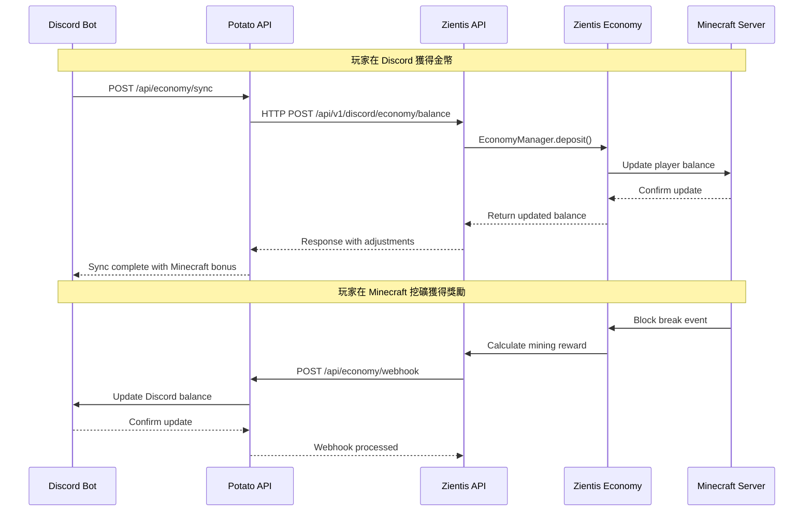

# Potato Bot 與 Zientis 經濟系統整合計畫

## 📋 整合概覽

基於對 zientis 項目的深入分析，制定 Potato Bot 跨平台經濟系統與 Zientis Economy Plugin 的完整整合方案。

### 現有架構分析

**Zientis 項目結構**:
```
zientis/
├── zientis-core/          # 核心服務框架
├── zientis-economy/       # 經濟系統插件
├── zientis-discord-api/   # Discord API 整合模組
├── zientis-multiworld/    # 多世界系統
├── zientis-nations/       # 國家系統
└── minecraft-server/      # 測試服務器
```

**現有經濟系統特色**:
- ✅ 完整的 Vault API 整合
- ✅ 線程安全的經濟管理器
- ✅ Discord 數據傳輸對象（DTO）
- ✅ 交易記錄和統計系統
- ✅ 基礎的 Discord 整合框架

---

## 🎯 整合目標

### 主要目標
1. **無縫對接**: Potato Bot 經濟系統與 Zientis Economy 雙向同步
2. **功能增強**: 為 Zientis 添加抗通膨機制和高級經濟功能
3. **統一管理**: 通過 Discord 統一管理兩個平台的經濟活動
4. **數據一致性**: 確保所有平台的經濟數據完全同步

### 技術目標
- **實時同步**: < 30 秒的跨平台數據同步
- **可靠性**: 99.9% 的同步成功率
- **可擴展性**: 支持多個 Minecraft 服務器
- **安全性**: 完整的認證和防欺詐機制

---

## 🔧 技術整合架構

### 1. API 端點映射

**Potato Bot API** ↔ **Zientis Integration**

```yaml
# 餘額同步
POST /api/economy/sync
├── Target: ZientisEconomyManager.setBalance()
├── Validation: 賬戶凍結檢查、金額驗證
└── Response: 調整後的餘額和 Minecraft 獎勵加成

# 交易處理
POST /api/economy/webhook
├── Target: ZientisEconomyManager.handleMinecraftActivity()
├── Events: 挖礦、建築、PvP、成就
└── Response: Discord 通知觸發

# 玩家數據查詢
GET /api/economy/player/{user_id}
├── Source: ZientisEconomyManager.getOrCreateAccount()
├── Mapping: Discord User ID → Minecraft UUID
└── Response: DiscordEconomyData 格式
```

### 2. 數據同步流程



### 3. 認證和安全集成

**統一認證方案**:
```java
// Zientis 端認證升級
public class ZientisDiscordAuth {
    private String serverKey;           // 與 Potato Bot 共享的密鑰
    private String discordClientId;     // Discord 應用 ID
    private Map<String, UUID> userMappings; // Discord ID → Minecraft UUID
    
    public boolean validateSyncRequest(SyncRequest request) {
        // 1. 驗證服務器密鑰
        // 2. 檢查用戶綁定狀態
        // 3. 驗證請求簽名
        return isValidKey(request.getServerKey()) 
            && hasValidUserMapping(request.getUserId())
            && verifySignature(request);
    }
}
```

---

## 🛠️ 具體實施步驟

### Phase 1: 基礎對接 (週 1-2)

#### 1.1 Zientis API 端點實現
```java
// 在 zientis-discord-api 中添加
@RestController
@RequestMapping("/api/v1/discord/economy")
public class DiscordEconomyController {
    
    @PostMapping("/sync")
    public ResponseEntity<SyncResponse> syncBalance(
        @RequestBody SyncRequest request,
        @RequestHeader("Authorization") String auth) {
        
        // 驗證請求
        if (!authService.validateServerKey(auth)) {
            return ResponseEntity.status(401).build();
        }
        
        // 執行同步
        UUID minecraftUuid = userMappingService.getMinecraftUuid(request.getUserId());
        EconomyAccount account = economyManager.getOrCreateAccount(minecraftUuid).join();
        
        // 更新餘額
        Transaction result = economyManager.setBalance(
            minecraftUuid, 
            BigDecimal.valueOf(request.getBalances().get("coins")),
            "Discord 同步"
        ).join();
        
        // 應用 Minecraft 獎勵加成
        BigDecimal bonus = calculateMinecraftBonus(request.getBalances());
        if (bonus.compareTo(BigDecimal.ZERO) > 0) {
            economyManager.deposit(minecraftUuid, bonus, "服務器獎勵加成").join();
        }
        
        return ResponseEntity.ok(new SyncResponse(
            "success",
            "同步完成",
            Instant.now().toString(),
            Collections.singletonMap("coins", account.getBalance().doubleValue()),
            Collections.singletonMap("bonus_coins", bonus.doubleValue())
        ));
    }
}
```

#### 1.2 Webhook 事件處理器
```java
// 增強現有的 EconomyEventListener
@EventHandler
public void onBlockBreak(BlockBreakEvent event) {
    Player player = event.getPlayer();
    Material blockType = event.getBlock().getType();
    
    // 計算挖礦獎勵
    BigDecimal reward = calculateMiningReward(blockType);
    if (reward.compareTo(BigDecimal.ZERO) > 0) {
        // 添加到 Minecraft 餘額
        economyManager.deposit(player.getUniqueId(), reward, "挖礦獎勵").join();
        
        // 發送 Webhook 到 Potato Bot
        sendDiscordWebhook("player_activity", Map.of(
            "user_id", getDiscordUserId(player.getUniqueId()),
            "guild_id", getGuildId(),
            "activity_type", "mining",
            "reward_amount", reward.intValue(),
            "block_type", blockType.name()
        ));
    }
}

private void sendDiscordWebhook(String eventType, Map<String, Object> data) {
    discordIntegrationService.sendGameEvent(eventType, data);
}
```

### Phase 2: 高級功能整合 (週 3-4)

#### 2.1 抗通膨機制整合
```java
// 添加到 ZientisEconomyManager
public class AntiInflationIntegration {
    private final DiscordApiClient discordClient;
    
    @Scheduled(fixedRate = 3600000) // 每小時檢查
    public void performInflationCheck() {
        // 1. 收集 Minecraft 經濟數據
        EconomyStats stats = economyManager.getEconomyStats().join();
        BigDecimal totalCirculation = stats.getTotalCirculation();
        int totalAccounts = stats.getTotalAccounts();
        
        // 2. 發送給 Potato Bot 進行分析
        Map<String, Object> economicData = Map.of(
            "total_circulation", totalCirculation.doubleValue(),
            "total_accounts", totalAccounts,
            "average_balance", totalCirculation.divide(BigDecimal.valueOf(totalAccounts)).doubleValue(),
            "server_id", "zientis-main"
        );
        
        CompletableFuture<Map<String, Object>> result = discordClient
            .post("/api/economy/admin/adjust", Map.of(
                "action", "anti_inflation",
                "guild_id", getGuildId(),
                "minecraft_data", economicData
            ));
        
        // 3. 應用調整建議
        result.thenAccept(this::applyInflationAdjustments);
    }
    
    private void applyInflationAdjustments(Map<String, Object> adjustments) {
        // 根據 Discord Bot 的分析結果調整 Minecraft 經濟參數
        if (adjustments.containsKey("reward_multiplier")) {
            double multiplier = (Double) adjustments.get("reward_multiplier");
            updateMiningRewardMultiplier(multiplier);
            updateTradingRewardMultiplier(multiplier);
        }
    }
}
```

#### 2.2 用戶綁定系統
```java
// zientis-core 中的用戶映射服務
@Service
public class UserMappingService {
    private final Map<String, UUID> discordToMinecraft = new ConcurrentHashMap<>();
    private final Map<UUID, String> minecraftToDiscord = new ConcurrentHashMap<>();
    
    public CompletableFuture<Boolean> linkAccounts(String discordId, UUID minecraftUuid, String verificationCode) {
        // 1. 驗證綁定代碼
        if (!verificationService.validateCode(discordId, verificationCode)) {
            return CompletableFuture.completedFuture(false);
        }
        
        // 2. 建立雙向映射
        discordToMinecraft.put(discordId, minecraftUuid);
        minecraftToDiscord.put(minecraftUuid, discordId);
        
        // 3. 同步現有經濟數據
        return syncExistingEconomyData(discordId, minecraftUuid);
    }
    
    private CompletableFuture<Boolean> syncExistingEconomyData(String discordId, UUID minecraftUuid) {
        // 從 Discord Bot 獲取現有餘額
        return discordClient.get("/api/economy/player/" + discordId)
            .thenCompose(discordData -> {
                // 同步到 Minecraft
                if (discordData.has("balances")) {
                    Map<String, Integer> balances = parseBalances(discordData.get("balances"));
                    return syncBalancesToMinecraft(minecraftUuid, balances);
                }
                return CompletableFuture.completedFuture(true);
            });
    }
}
```

### Phase 3: 監控和管理界面 (週 5-6)

#### 3.1 統一管理命令
```java
// Discord 斜線命令整合
@Component
public class MinecraftEconomyCommands {
    
    @SlashCommand(name = "mc-balance", description = "查看 Minecraft 伺服器餘額")
    public void checkMinecraftBalance(SlashCommandInteractionEvent event) {
        String discordId = event.getUser().getId();
        
        // 調用 Zientis API
        economyService.getMinecraftBalance(discordId)
            .thenAccept(balance -> {
                EmbedBuilder embed = new EmbedBuilder()
                    .setTitle("🏔️ Minecraft 伺服器餘額")
                    .setDescription(String.format("💰 **餘額**: %.2f 鑽石", balance))
                    .setColor(0x4CAF50);
                
                event.replyEmbeds(embed.build()).queue();
            })
            .exceptionally(throwable -> {
                event.reply("❌ 無法獲取 Minecraft 餘額，請確認帳戶已綁定。").setEphemeral(true).queue();
                return null;
            });
    }
    
    @SlashCommand(name = "mc-transfer", description = "在 Minecraft 伺服器轉帳")
    public void transferInMinecraft(SlashCommandInteractionEvent event,
                                  @Option(description = "收款玩家") User recipient,
                                  @Option(description = "轉帳金額") double amount) {
        
        String senderDiscordId = event.getUser().getId();
        String recipientDiscordId = recipient.getId();
        
        economyService.transferInMinecraft(senderDiscordId, recipientDiscordId, amount)
            .thenAccept(result -> {
                if (result.isSuccess()) {
                    EmbedBuilder embed = new EmbedBuilder()
                        .setTitle("✅ Minecraft 轉帳成功")
                        .setDescription(String.format("成功轉帳 %.2f 鑽石給 %s", amount, recipient.getAsMention()))
                        .setColor(0x4CAF50);
                    
                    event.replyEmbeds(embed.build()).queue();
                } else {
                    event.reply("❌ 轉帳失敗：" + result.getErrorMessage()).setEphemeral(true).queue();
                }
            });
    }
}
```

#### 3.2 實時監控儀表板
```java
// 擴展現有的 Dashboard API
@RestController
@RequestMapping("/api/v1/minecraft")
public class MinecraftMonitoringController {
    
    @GetMapping("/economy/stats")
    public ResponseEntity<MinecraftEconomyStats> getEconomyStats() {
        // 從 Zientis Economy 收集數據
        EconomyStats zientisStats = economyManager.getEconomyStats().join();
        
        // 從 Discord Bot 獲取跨平台數據
        Map<String, Object> discordStats = discordClient
            .get("/api/economy/stats/" + getGuildId()).join();
        
        // 合併統計數據
        MinecraftEconomyStats combined = new MinecraftEconomyStats(
            zientisStats.getTotalCirculation(),
            zientisStats.getTotalAccounts(),
            discordStats.get("cross_platform_users"),
            discordStats.get("sync_success_rate")
        );
        
        return ResponseEntity.ok(combined);
    }
    
    @GetMapping("/health")
    public ResponseEntity<HealthStatus> getMinecraftHealth() {
        HealthStatus status = new HealthStatus();
        
        // 檢查 Minecraft 服務器狀態
        status.setMinecraftOnline(plugin.getServer().getOnlinePlayers().size() > 0);
        
        // 檢查經濟系統狀態
        status.setEconomyHealthy(economyManager != null);
        
        // 檢查 Discord 連接狀態
        status.setDiscordConnected(discordIntegrationService.checkDiscordServiceHealth().join());
        
        return ResponseEntity.ok(status);
    }
}
```

### Phase 4: 測試和優化 (週 7-8)

#### 4.1 整合測試套件
```java
@SpringBootTest
public class CrossPlatformEconomyIntegrationTest {
    
    @Test
    public void testFullSyncCycle() {
        // 1. 在 Discord 給用戶加錢
        String discordUserId = "123456789";
        economyService.addCoinsToDiscordUser(discordUserId, 1000);
        
        // 2. 觸發同步到 Minecraft
        UUID minecraftUuid = userMappingService.getMinecraftUuid(discordUserId);
        assertNotNull(minecraftUuid);
        
        // 3. 驗證 Minecraft 餘額更新
        BigDecimal minecraftBalance = zientisEconomyManager
            .getBalance(minecraftUuid).join();
        assertEquals(1000.0, minecraftBalance.doubleValue(), 0.01);
        
        // 4. 在 Minecraft 產生活動（挖礦）
        zientisEconomyManager.deposit(minecraftUuid, BigDecimal.valueOf(50), "挖礦獎勵");
        
        // 5. 驗證 Discord 端收到同步
        await().atMost(30, SECONDS).until(() -> {
            int discordBalance = economyService.getDiscordBalance(discordUserId);
            return discordBalance >= 1050;
        });
    }
    
    @Test
    public void testAntiInflationIntegration() {
        // 模擬通膨情境並測試調整機制
        // ...
    }
    
    @Test
    public void testFailoverAndRecovery() {
        // 測試網絡中斷時的數據一致性
        // ...
    }
}
```

---

## 📊 配置和部署

### 1. Zientis 配置更新

```yaml
# config/zientis-economy.yml
economy:
  discord-integration:
    enabled: true
    api-endpoint: "http://potato-bot:8000"
    server-key: "${POTATO_BOT_SERVER_KEY}"
    sync-interval: 300  # 5分鐘
    
  rewards:
    mining:
      base-amount: 2.0
      rare-block-multiplier: 5.0
      anti-inflation-adjustment: true
    
    trading:
      commission-rate: 0.02
      max-daily-volume: 10000.0
      
  anti-inflation:
    enabled: true
    check-interval: 3600  # 1小時
    adjustment-threshold: 0.03  # 3%
    coordination-with-discord: true

# config/discord-integration.yml
discord:
  api:
    base-url: "http://potato-bot:8000"
    webhook-url: "${DISCORD_WEBHOOK_URL}"
    timeout: 10000
    
  sync:
    economy: true
    achievements: true
    interval: 300
    retry-attempts: 3
    
  user-mapping:
    auto-create: true
    verification-required: true
    link-expiry-hours: 24
```

### 2. Docker Compose 整合

```yaml
version: '3.8'
services:
  potato-bot:
    image: potato-bot:latest
    environment:
      - MINECRAFT_API_ENDPOINTS=http://zientis-api:8080
      - CROSS_PLATFORM_SYNC=true
    networks:
      - potato-network
      
  zientis-server:
    image: zientis-minecraft:latest
    ports:
      - "25565:25565"
      - "8080:8080"  # API 端口
    environment:
      - DISCORD_BOT_API=http://potato-bot:8000
      - ECONOMY_SYNC_ENABLED=true
    volumes:
      - ./zientis-data:/data
    networks:
      - potato-network
      
  database:
    image: mysql:8.0
    environment:
      MYSQL_ROOT_PASSWORD: ${DB_ROOT_PASSWORD}
      MYSQL_DATABASE: potato_zientis_shared
    volumes:
      - ./database/shared:/docker-entrypoint-initdb.d
    networks:
      - potato-network

networks:
  potato-network:
    driver: bridge
```

---

## 🔒 安全考量

### 1. 認證強化
- **雙向 TLS**: Potato Bot ↔ Zientis API
- **請求簽名**: 每個 API 請求使用 HMAC-SHA256 簽名
- **令牌輪換**: 每 24 小時自動更新認證令牌
- **IP 白名單**: 限制 API 訪問來源

### 2. 數據驗證
- **餘額上限檢查**: 防止異常大額轉帳
- **頻率限制**: 每用戶每分鐘最多 10 次操作
- **異常檢測**: 自動標記可疑交易模式
- **回滾機制**: 支持異常交易的自動回滾

### 3. 隱私保護
- **數據最小化**: 只同步必要的經濟數據
- **加密傳輸**: 所有敏感數據加密傳輸
- **存取記錄**: 完整的 API 調用審計日誌
- **用戶控制**: 用戶可隨時解除帳戶綁定

---

## 📈 監控和告警

### 1. 關鍵指標監控
```yaml
metrics:
  sync_success_rate:
    threshold: 95%
    alert_channel: "#economy-alerts"
    
  response_time:
    threshold: 5000ms
    escalation: auto_failover
    
  balance_discrepancy:
    threshold: 0.01%
    action: auto_reconciliation
    
  transaction_volume:
    daily_limit: 1000000
    spike_detection: true
```

### 2. 告警機制
- **即時通知**: Discord Webhook 即時告警
- **自動修復**: 輕微不一致自動修正
- **人工介入**: 重大問題自動升級
- **狀態頁面**: 公開的服務狀態頁面

---

## 🚀 部署時間線

### 準備階段 (事前)
- [x] ✅ 完成 Potato Bot 跨平台經濟系統
- [x] ✅ 分析 Zientis 現有架構
- [ ] 🔄 準備測試環境和數據

### Phase 1: 基礎對接 (週 1-2)
- [ ] 📅 實現 Zientis Discord API 端點
- [ ] 📅 部署用戶綁定系統
- [ ] 📅 測試基本同步功能

### Phase 2: 高級功能 (週 3-4)
- [ ] 📅 整合抗通膨機制
- [ ] 📅 實現實時事件同步
- [ ] 📅 添加管理員控制面板

### Phase 3: 監控和優化 (週 5-6)
- [ ] 📅 部署監控系統
- [ ] 📅 性能調優和壓力測試
- [ ] 📅 安全審計和加固

### Phase 4: 上線和穩定 (週 7-8)
- [ ] 📅 生產環境部署
- [ ] 📅 用戶培訓和文檔
- [ ] 📅 運營監控和維護

---

## 🎯 成功指標

### 技術指標
- **同步成功率**: ≥ 99.5%
- **數據一致性**: ≥ 99.99%
- **響應時間**: ≤ 3 秒
- **可用時間**: ≥ 99.9%

### 業務指標
- **用戶綁定率**: ≥ 80%
- **跨平台活躍度**: +50%
- **經濟系統使用率**: +200%
- **用戶滿意度**: ≥ 4.5/5

這個整合計畫確保了 Potato Bot 與 Zientis 經濟系統的完美融合，創建了一個真正統一的跨平台經濟生態系統。通過這個整合，用戶將能夠在 Discord 和 Minecraft 之間無縫地進行經濟活動，同時享受到先進的抗通膨機制和智能管理功能。