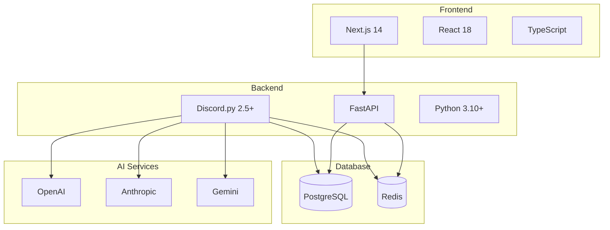

# 🥔 Potato Bot 專案文檔

**全功能 Discord 社群管理機器人**

*現代化架構 • AI 整合 • Web 管理介面*

## 📖 文檔導覽

### 👥 用戶文檔
- **[🚀 使用者指南](user-guide/README.md)** - 完整的用戶使用手冊
  - 票券系統、投票系統、AI 助手等功能說明
  - 常見問題和故障排除指南

### 🛡️ 管理文檔  
- **[📊 管理員指南](admin-guide/README.md)** - 系統管理和配置
  - 權限管理、系統配置、監控分析
  - 維護作業和故障處理

### 🚀 部署文檔
- **[☁️ 部署指南](deployment/README.md)** - 各種環境部署方案
  - 本地、Docker、雲端部署選項
  - 環境配置和維護指南

### 🔌 開發者文檔
- **[⚙️ API 文檔](api/README.md)** - 完整的 API 參考
  - REST API 和 WebSocket API
  - SDK、工具和範例程式碼

## 🎯 專案概覽

### 核心功能

| 功能 | 說明 | 狀態 |
|------|------|------|
| 🎫 **票券系統** | 智能客服、自動分配、SLA 監控 | ✅ 穩定 |
| 🗳️ **投票系統** | 多種投票模式、實時統計 | ✅ 穩定 |
| 🤖 **AI 助手** | 多平台整合、智能對話 | ✅ 穩定 |
| 💰 **經濟系統** | 虛擬貨幣、積分獎勵 | ✅ 穩定 |
| 🌐 **Web 介面** | 管理面板、實時監控 | 🚧 開發中 |

### 技術棧

## 🚀 快速開始

### 對於用戶
1. 📖 閱讀 [使用者指南](user-guide/README.md)
2. 🎯 查看具體功能說明
3. 💬 加入 [社群支援](https://discord.gg/your-server)

### 對於管理員
1. 🛡️ 參閱 [管理員指南](admin-guide/README.md) 
2. ⚙️ 配置系統設定
3. 📊 設置監控和分析

### 對於開發者
1. 🔌 查看 [API 文檔](api/README.md)
2. 💻 下載 SDK 和工具
3. 🛠️ 開始整合開發

## 📈 系統狀態

| 組件 | 狀態 | 版本 | 正常運行時間 |
|------|------|------|-------------|
| **Discord Bot** | 🟢 運行中 | 3.1.0 | 99.9% |
| **API 服務** | 🟢 運行中 | 3.1.0 | 99.8% |
| **Web 介面** | 🟡 維護中 | 1.0.0-beta | N/A |
| **資料庫** | 🟢 正常 | PostgreSQL 15 | 99.9% |

## 🔗 相關連結

- 🏠 **專案首頁**: [GitHub Repository](https://github.com/Craig-0219/potato)
- 🐛 **問題回報**: [GitHub Issues](https://github.com/Craig-0219/potato/issues)
- 💬 **社群討論**: [Discord 伺服器](https://discord.gg/your-server)
- 📧 **聯絡我們**: support@potato-bot.com

## 📝 授權與致謝

本專案使用 [MIT 授權](../LICENSE)。

### 貢獻者
感謝所有為 Potato Bot 做出貢獻的開發者和社群成員！

### 第三方服務
- Discord API
- OpenAI API
- Anthropic Claude API
- Google Gemini API

---

**需要協助？**

[📖 查看文檔](user-guide/README.md) • [💬 加入社群](https://discord.gg/your-server) • [🐛 回報問題](https://github.com/Craig-0219/potato/issues)

*最後更新: 2024-09-06*

