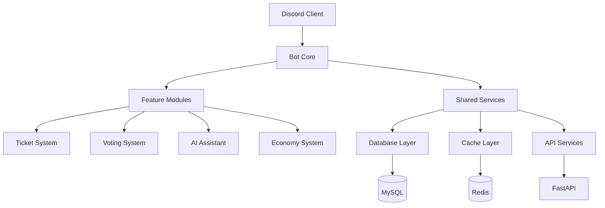

# 🥔 Potato Bot 專案文檔

**全功能 Discord 社群管理機器人**

*企業級架構 • AI 整合 • 現代化設計*

---

## 🎯 專案概覽

Potato Bot 是一個功能完整的 Discord 機器人，採用現代化架構設計，提供企業級的社群管理功能。

### 核心特色

=== "🎫 智能客服"
    - **自動票券管理** - 智能分類、自動路由
    - **SLA 監控** - 回應時間追蹤
    - **評分系統** - 服務品質評估
    - **工作流自動化** - 自訂處理流程

=== "🤖 AI 整合"
    - **多平台支援** - OpenAI、Anthropic、Gemini
    - **智能對話** - 上下文感知、情感分析
    - **內容審核** - 自動檢測不當內容
    - **用量管理** - 配額限制、成本控制

=== "🗳️ 投票系統"
    - **實時投票** - 動態結果更新
    - **多種模式** - 單選、多選、排序
    - **權限控制** - 角色限制、匿名投票
    - **資料分析** - 詳細統計報告

=== "💰 經濟系統"
    - **虛擬貨幣** - 積分獎勵機制
    - **服務計費** - 功能使用成本
    - **每日獎勵** - 活躍度激勵
    - **交易記錄** - 完整財務追蹤

## 🚀 快速開始

### 用戶指南
- 📖 [使用者手冊](user-guide/commands.md) - 完整指令列表
- 🎮 [核心功能](user-guide/features/voting-system.md) - 功能詳解

### 開發者
- ⚡ [快速開始](getting-started/quickstart.md) - 5 分鐘部署
- 🛠️ [開發環境](getting-started/project-setup.md) - 本地開發設置
- 🤝 [貢獻指南](getting-started/contributing.md) - 參與開發

### 系統管理
- ⚙️ [系統設計](system-design/admin-permissions.md) - 權限管理
- 🔧 [API 文檔](developer-docs/api-reference.md) - 介面說明

## 🏗️ 架構設計

## 📊 系統狀態

| 組件 | 狀態 | 版本 | 說明 |
|------|------|------|------|
| **Discord Bot** | ✅ 運行中 | 2.3.2 | 主要機器人服務 |
| **API 服務** | ✅ 運行中 | FastAPI 0.104+ | RESTful API |
| **資料庫** | ✅ 運行中 | MySQL 8.0+ | 主要資料存儲 |
| **快取系統** | ✅ 運行中 | Redis 7.0+ | 效能優化 |

## 🔗 相關連結

- 📚 **完整文檔** - 正在閱讀
- 🐛 **問題回報** - [GitHub Issues](https://github.com/Craig-0219/potato/issues)
- 💬 **社群討論** - [Discord 伺服器](https://discord.gg/your-server)
- 🚀 **版本發布** - [Releases](https://github.com/Craig-0219/potato/releases)

---

**準備開始了嗎？** [立即部署 →](getting-started/quickstart.md){ .md-button .md-button--primary }

*或者查看我們的 [使用者指南](user-guide/commands.md) 了解更多功能*

