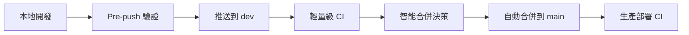

# 🚀 新的開發工作流程指南

## 📋 概述

我們重新設計了智能合併系統，將驗證工作前移到開發階段，大幅提升了開發效率和 CI 資源利用率。

## 🔄 新工作流程



### 階段 1: 本地開發環境

**首次設置**：
```bash
# 安裝 Git hooks
bash scripts/install-hooks.sh

# 安裝開發依賴
pip install black isort flake8 detect-secrets
```

**日常開發**：
```bash
# 正常提交和推送
git add .
git commit -m "✨ 新功能: 添加用戶管理系統"
git push origin dev  # 觸發 pre-push 驗證
```

### 階段 2: 推送前驗證 (Pre-push Hook)

**自動執行**：
- ✅ 代碼格式化檢查 (black, isort)
- ✅ 靜態分析 (flake8)
- ✅ 安全掃描 (detect-secrets)
- ✅ 基本語法檢查
- ✅ 關鍵依賴驗證

**跳過方式**：
```bash
# 方式1: 環境變數
SKIP_PRE_PUSH_TESTS=true git push origin dev

# 方式2: 提交標記
git commit -m "🚧 WIP: 實驗性功能 [skip-hooks]"
```

### 階段 3: 輕量級 CI (GitHub Actions)

**觸發條件**: 推送到 dev 分支  
**執行時間**: 3-5 分鐘  
**檢查項目**:
- 🔍 語法驗證測試
- 🔧 配置載入測試
- 🚀 基本服務初始化測試
- 📊 依賴一致性檢查

### 階段 4: 智能合併系統

**自動判斷**：
- 📚 僅文檔變更 → 跳過合併
- ✨ 小規模變更 (≤5 檔案) → 自動合併
- 🔄 一般變更 (≤10 檔案, ≤1 核心檔案) → 自動合併
- ⚠️ 大規模變更 → CI 通過後合併

**手動控制**：
```bash
git commit -m "🔀 準備發布 v2.1.0 [merge]"        # 強制合併
git commit -m "🚧 實驗性變更 [no-merge]"           # 跳過合併
git commit -m "🔧 修復關鍵問題 [force-merge]"      # 強制合併(跳過檢查)
```

### 階段 5: 生產 CI/CD

**觸發條件**: main 分支變更  
**執行項目**:
- 🏭 完整的生產環境測試
- 🚀 自動部署到生產環境
- 🔍 部署後驗證

## 🎯 提交訊息規範

### 標準格式
```
<type>(<scope>): <description>

[optional body]

[optional footer]
```

### Type 類型
- ✨ `feat`: 新功能
- 🔧 `fix`: 修復問題
- 📚 `docs`: 文檔變更
- 🎨 `style`: 代碼格式化
- ♻️ `refactor`: 重構
- 🧪 `test`: 測試相關
- 🔨 `build`: 構建系統

### 特殊標記
- `[merge]` - 強制自動合併
- `[no-merge]` - 跳過自動合併
- `[force-merge]` - 強制合併(跳過額外檢查)
- `[skip-hooks]` - 跳過 Git hooks
- `[skip-ci]` - 跳過 CI 檢查
- `[test-integration]` - 執行整合測試

### 範例
```bash
git commit -m "✨ 新增用戶認證系統

- 添加 JWT token 管理
- 實現登入/登出功能  
- 新增權限驗證中間件

[merge]"
```

## 🛠️ 開發工具配置

### VS Code 設置
```json
{
    "python.formatting.provider": "black",
    "python.linting.flake8Enabled": true,
    "editor.formatOnSave": true,
    "git.enableCommitSigning": true
}
```

### PyCharm 設置
1. **File → Settings → Tools → External Tools**
2. 添加 Black 和 isort 工具
3. 設置自動格式化快捷鍵

## 🚨 故障排除

### Pre-push Hook 失敗
```bash
# 檢查錯誤訊息
git push origin dev

# 修復格式問題
black bot/ shared/ tests/
isort bot/ shared/ tests/

# 重新推送
git push origin dev
```

### 自動合併失敗
1. 檢查 GitHub Actions 日誌
2. 查看合併衝突
3. 手動執行合併：
   ```bash
   git checkout main
   git pull origin main
   git merge dev
   git push origin main
   ```

### CI 檢查失敗
1. 本地運行相同檢查：
   ```bash
   python -m py_compile bot/main.py
   python -c "from shared.config import Config"
   ```
2. 修復問題後重新推送

## 📊 效益對比

### 舊流程 vs 新流程

| 項目 | 舊流程 | 新流程 | 改善 |
|------|---------|---------|------|
| CI 執行時間 | 15-20 分鐘 | 3-5 分鐘 | 75% ⬇️ |
| 問題發現時間 | 推送後 15+ 分鐘 | 推送前 2 分鐘 | 85% ⬇️ |
| CI 資源消耗 | 高 | 低 | 70% ⬇️ |
| 開發反饋速度 | 慢 | 快 | 90% ⬆️ |
| 修復成本 | 高 | 低 | 80% ⬇️ |

## 🎉 總結

新的工作流程讓開發更加高效：

1. **更快的反饋** - 問題在推送前就被發現
2. **更少的等待** - CI 檢查時間大幅縮短
3. **更高的品質** - 自動化的代碼品質保證
4. **更智能的合併** - 根據變更類型智能決策

Happy coding! 🚀